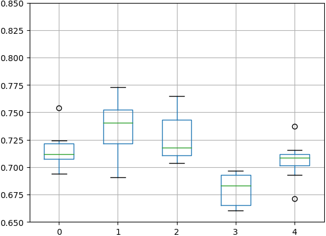
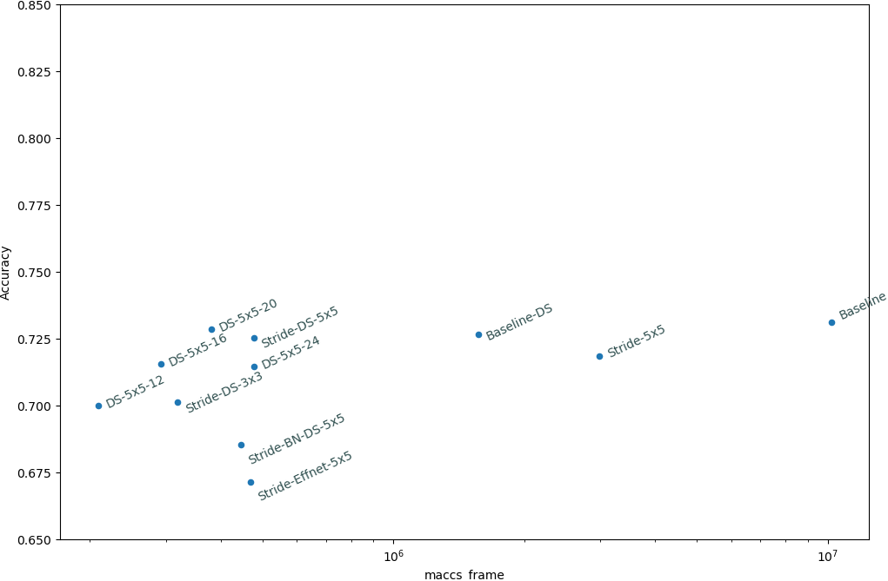
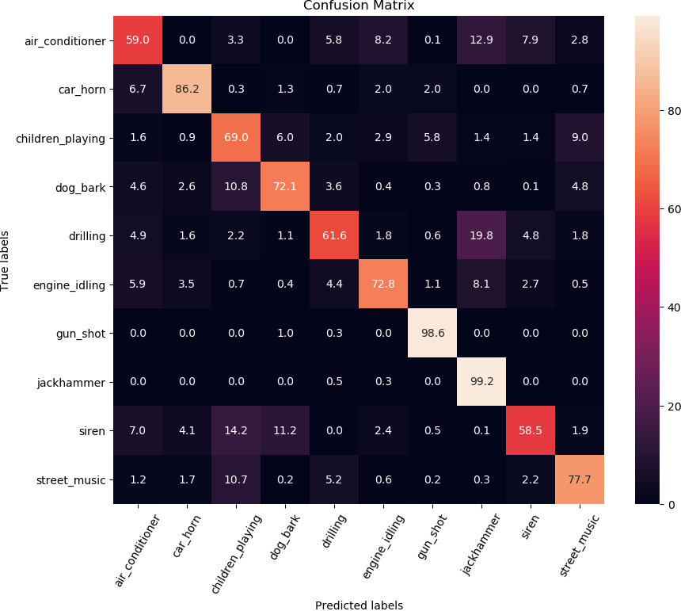
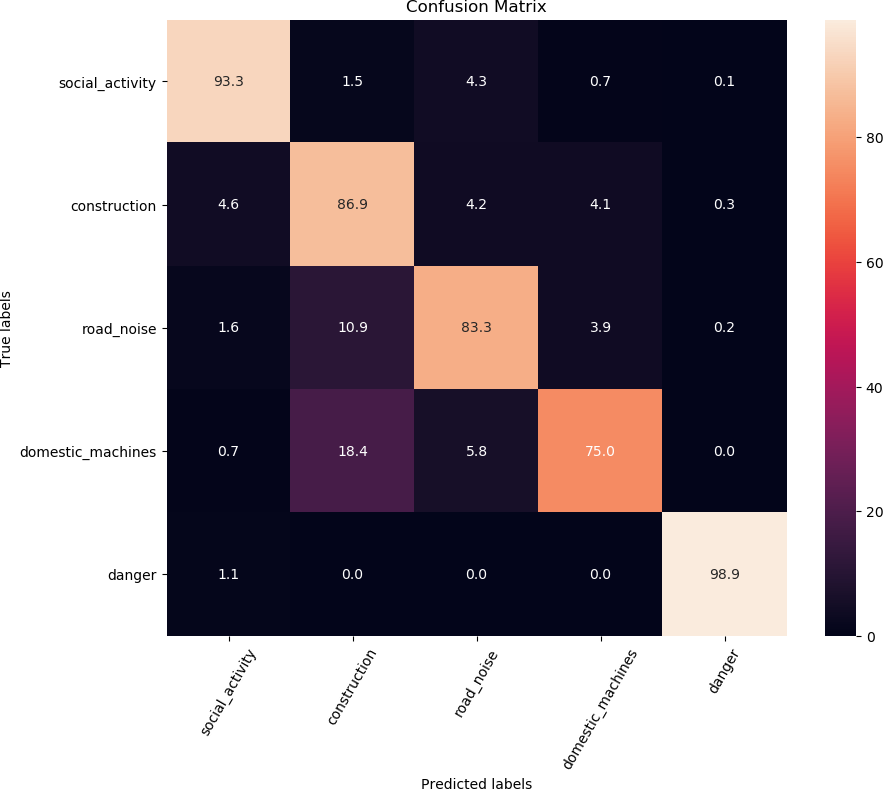

<!---

Contributions

- Demonstrate an ESC system running on a 5 USD microcontroller.
Resulting in XX% accuracy on Urbansound8k dataset.
- First evaluations of modern efficient CNNs such as
MobileNet, SqueezeNet on Urbansound8k dataset 
- Set of tools for STM32 CubeMX AI to overcome current limitations
in the platform

-->


\newpage
# Introduction

<!---
Sound
    Importance. 

Noise
Sources of noise.
    People talking
    Dogs barking
    Construction
    Air Conditioner, Refridgerator
    
Health problems. Sleep disturbance, 
Economic impact. Reduced value of 
Types of noise. Occuptional. Environmental noise
Regulations


Noise assesment
Challenges.
    Local problem, multiple sources, time-dependent
    Perceptual/subjective evaluation
    Positive sound qualities. Recreational
Increasing noise problem. Urbanization

Track noise level, plan/take corrective action. Visibility
Identifying source. Environmental Sound Classification
Smart-city concept, data-driven

Privacy, GDPR
=> this thesis
-->


Sound is everywhere around us, and a rich source of information about our surroundings.

Like other animals, humans communicate 

We use sound explicitly to communicate when we talk, offering observations, facts


![Health impacts of noise at different severity levels[@NoiseStressConcept]](./img/noiseseverity.png)


## Importance

When we talk, sound is a critical part of our communication, conveying not just statements
but also information about.
As we walk around 

Sound can convey information also when 
before we can see them
alerted about dangerous situation

Sound is used to communicate, be it by speech, audible gestures or computerized signals (

car speeding up or slowing down
fire alarm

We communicate with eachother using sound when we talk, 

communicating with intent

side-effect of many human activities


source of information
understanding of the environment around us


Since the industrial revolution, the human soundscape has become increasingly busy.

mechanical and electromechanical devices
Urbanization. Many more people in the same area

transportation. Cars, railroads, aeroplanes
construction. Drilling, cutting
machinery

The sum of all the noise is referred to as Environmental noise.

Environmental noise is the summary of noise pollution from outside,
caused by transport, industrial and recreational activities.


## Regulation

Environmental noise is a type of noise pollution, and is regulated.

In the EU, Environmental noise is regulated Environmental Noise Directive (2002/49/EC)[@EuNoiseDirective].

The purpose of the directive is to:

* determine peoples exposure to environmental noise
* ensuring that information on environmental noise and its effects is available to the public
* preventing and reducing environmental noise where necessary
* preserving environmental noise quality where it is good

The Directive requires Member States to prepare and publish noise maps and noise management action plans every 5 years for
urban areas and major road, railways and airports.

The Directive does not set limit or target values, nor does it prescribe the measures to be included in the action plans.
This is up to authorities of each individual Member State.


## Health impact

According to European Commission introduction on the Health effects of Noise [@EuNoiseHealthEffects],
Noise pollution the second environmental cause of health problems in Europe, after air pollution.

Sleepers that are exposed to night noise levels above 40dB on average throughout
the year can suffer health effects like sleep disturbance and awakenings.
Above 55dB long-term average exposure, noise can trigger elevated blood pressure and lead to ischemic heart disease.
The WHO has set a Night Noise Guideline level for Europe at 40 dB $L_{night}$.

According to a report done on behalf of the European Commision[@RVIMTransportationNoise]

"The exposure to transportation noise in Europe led in 2011 to about
900 thousand cases of hypertension and 40 thousand hospital admissions due to cardiovascular disease and stroke"
and "the number of cases of premature mortality due to these diseases as a result of noise exposure is about 10 thousand per year.",
and "An estimated 8 million people experience sleep disturbance due to transportation noise and about 4 million perceive this as severe".


## Noise monitoring with Wireless Sensor Networks

`TODO: add an image of noise in city, maybe with sensors`

Several cities have started to deploy networks of sound sensors in order to understand and reduce noise issues.
These consist of many sensor nodes positioned in the area of interest,
transmitting the data to a central system for storage and reporting.

The SONYC[@SONYC] project in New York City had 56 sound sensors as of 2018.[@SONYC2019]
The Barcelona Noise Monitoring System[@BarcelonaNoiseMonitoring] had 86 sound sensors as of 2018.[@BarcelonaNoiseMonitoring2018].
CENSE[@CENSE] project plans to install around 150 sensors in Lorient, France[@CENSESensor].

To keep costs low and support a dense coverage, the sensor nodes are often designed to operate wirelessly.
Communication is done using wireless radio technologies such as WiFi, GSM, NB-IoT or 6LoWPAN.
Energy to power the sensor is harvested, either using solar power or from streetlight powered at night.
A battery backup allows the sensor to continue operating also when energy is momentarily unavailable.

These sensor networks enable continuous logging of the sound level (Leq dB).
Typical measurement resolution are per-minute, per second or per 125ms.
Sound level sensors in Europe are designed to specifications of IEC 61672-1 Sound Level Meters[@IECSoundLevelMeters],
with an accuracy of either Class 2 or Class 1.
The equivalent standard for North America is ANSI S1.4[@ANSISoundLevelMeters], and Type 1/2 accuracy.

`TODO: write why knowing the noise source/type is useful`

Most sensors also aim to provide information that can be used to characterize the noise.
This requires much more data than sound level measurements,
making it challenging to transmit within the bandwidth and energy budget of a sensor.
Recording and storing detailed audio data may also capture sensitive information and violate privacy requirements.

To address these concerns several methods for efficiently coding the information before transmitting have been developed.

In [@AudioCodingSensorGrid], a compressed noise profile data is based on lossy compression of spectrograms is proposed.
For 125ms time resolution the bitrate is between 400 and 1400 bits per second,
however this gave a 5 percentage points reduction in classification accuracy.

Others have proposed to use neural networks to produce an audio "embedding" inspired
by the success of world embeddings for Natural Language Processing.
In VGGish model trained on Audioset[@VGGish] an a 8-bit, 128 dimensional embedding is used for 10 seconds clips,
leading to a datarate of 102 bits per second.
L^3 (Look, Listen, Learn)[@L3] similarly proposed an embedding with 512 dimensions.

The computation of such an embedding generally requires very large models and lots of compute resources.
EdgeL^3[@EdgeL3] showed that the L^3 model can be compressed by up to 95%,
however the authors state that more work is needed to fit the RAM constraints of desirable sensor hardware.

The minimal amount of data transmissions would be to only send the detected noise category.

This motivates the problem statement of this thesis:

> Can we classify environmental sounds directly on a wireless and battery-operated noise sensor?


<!---
Measuring noise

    Terminology. Sound Pressure Level
    Frequency weighting
    Summarizaton. Eq SPL. L10, L90, Lmax, Lpeak
    Spectrograms. Time-frequency characteristics. 1/3 acoustic bands
    Equipment

Sensor Networks for Noise Monitoring

    Research projects.
    Commercially available units.

    Sound sensor. Microphone
    Processing unit. Single-board-computers, microcontrollers
    Connectivity. WiFI, GSM, LoRa. Bandwidth, range, power consumption
    Energy source. Battery and Energy harvesting.
-->

\newpage
# Background

<!---

Digital Sound
    Spectrograms
    mel-spectrogram

Machine Learning.
    Fundamentals

Machine Learning on sound   
    **Classification**. Closed-set. Single label.
    Anslysis windows
    ?Weak labeling

Environmental Sound Classification (ESC).
    Definition, Datasets
    General methods -> CNN

Convolutional Neural Networks

Microcontrollers

Related works for our task...

-->

<!---
DROP

Acoustic Scene Classification. Context-dependent compute
Domestic Sound Classification. 
Event detection. Not fine identification in time (onset)
Open-set classification. Novelty detection, clustering
-->


## Digital sound

Physically, sound is a variation in pressure over time.
For machine learning, it must be exist in a digital representation.
The acoustic data is converted to analog electric signals by a microphone and
then digitized using an Analog-to-Digital-Converter (ADC).

`TODO: image of digital audio pipeline. From acoustical event to digital representation`

![From acoustical sound to digital and back. Source: [@ProcessingTutorial]](./images/digital-sound-processingorg.png)

In the digitization process, the signal is quantized in time at a certain sampling frequency,
and the amplitude quantized at a certain bit-depth.
A typical sampling frequency is 44100 Hz, and bit-depth 16 bit.
With these parameters, the acoustic sound can be reconstructed without perceivable differences by humans.

In this representation, sound is a 1 dimensional sequence of numbers.
This is sometimes referred to as a *waveform*. 

Digital sound can be stored uncompressed (example: PCM WAV),
using lossless compression (example: FLAC)
or using lossy compression (example: MP3).
Lossy compression removes information that are indistinguishable to the human hear
and can compress better than lossless.
It however adds compression artifacts, and is usually avoided for machine learning tasks.

Recordings can have multiple channels of audio but for machine learning on audio
single-channel (mono) data is still the most common.

### Spectrograms

Acoustic events.
Frequency analysis can reveal.

A common way to transform audio waveform into a spectrogram is by using the
Short Time Fourier Transform (STFT).

The STFT operates by splitting the audio up in small consecutive chunks.

The splitting is often computed with 50% overlap, and by applying a window function before computing the FFT.
The window function

In the Fourier Transform, and thus in the STFT, there is a trade-off between frequency resolution.
The longer the FFT window the better the frequency resolution, but the temporal resolution is reduced.
For speech a typical choice of window length is 25 ms.
Similar frame lengths are often adopted for acoustic events. `TODO: references`

![Computing frames from an audio signal, using windows functions. Based on image by [@AudioFraming]](./images/frames.png)


## Machine learning

Classification is a type of machine learning task where the goal is to
learn a model which can accurately predict which class(es) that data belongs to.
Examples use-cases could be to determine from a image which breed a dog is,
to predict from text whether - or to determine from audio what kind of sound is present.

`TODO: image of a labeled dataset`

In single-label classification, a sample can only belong to a single class. 
In closed-set classification, the possible class is one of N predetermined classes.
Many classification problems are treated as single-label and closed-set.


Models used for classification are often trained using supervised learning. 
Supervised learning uses a dataset where each sample is labeled with the right class.
These labels are normally provided by manual annotation by humans inspecting the data.

```TODO:
Class balance
metrics
```


The dataset is divided into multiple subsets that have different purposes.
The *training* set is data that the training algorithm uses to optimize the model on.
To estimate how well the model generalizes to new unseen data,
predictions are made on the *validation set*. 
The final performance of the trained model is evaluated on a *test set*,
which has not been used in the training process.
To get a better estimate of how the model performs it K-fold cross validation can be used,
where K different training/validation splits are attempted.
K is usually between 5 and 10.
The overall process is illustrated in Figure \ref{figure:crossvalidation}.

One common style of supervised learning processes is to start with an initial model with
some parameters, make predictions using this model, compare these prediction with the labels to compute
an error, and then update the parameters in order to attempt to reduce this error.
This iterative process is illustrated in \ref{figure:training-inference}.

The exact nature of the model parameters and parameter update algorithm
depends on what kind of classifier and training system is used.
For neural networks, see chapter `TODO: ref gradient descent`.

In addition to the parameters learned by the training process,
there are also *hyperparameters* which are parameters that cannot be learned by the training process,
Examples are settings of the training system itself, but also the
architecture and settings of predictive model itself can be seen as hyperparameters.
Hyperparameters can be chosen by selecting different candidates,
training to completion and evaluating performance on the validation set.


Once training is completed, the predictive model can be used stand-alone, using the learned parameters.


\newpage
## Audio Classification

Feature representations

### Mel-spectrogram

For machine learning it is desirable to reduce the dimensions of inputs as much as possible.
To do this on spectrograms the STFT spectrogram is often reduced to 30-128 frequency bands using a filter-bank.
Several different filter-bank alternatives have been investigated for audio classification tasks,
such as 1/3 octave bands, the Bark scale, Gammatone and the Mel scale.
All these have filters spacing that increase with frequency, mimicking the human auditory system.
See Figure \ref{figure:filterbanks}


The most commonly used for audio classification is the Mel scale.
The spectrogram that results for applying a Mel-scale filter-bank is often called a Mel-spectrogram.
`TODO: references`

`TODO: image of mel-spectrogram`

Mel-Filter Cepstral Coefficients (MFCC) is a feature representation
computed by performing a Discrete Cosine Transform (DCT) on a mel-spectrogram.
This further reduces dimensionality to just 13-20 bands and reduces correlation between each band.
This has been shown to work well for speech, but can perform worse on general sound classification tasks.
`TODO: reference Stowell birds`

### Normalization

Audio has a very large dynamic range.
The human hearing has a lower threshold of hearing down to $20\mu\text{Pa}$ (0 dB SPL)
and a pain threshold of over 20 Pa (120 dB SPL), a difference of 6 orders of magnitude[@smith1997scientist, ch.22].
A normal conversation may be 60 dB SPL and a pneumatic drill 110 dB SPL, a 4 orders of magnitude difference.
It is common to compress the range of values in spectrograms by applying a log transform.

In order to center the values, the mean (or median) of the spectrogram is often removed.
Scaling the output to a range of 0-1 or -1,1 is also sometimes done.
These changes have the effect of removing amplitude,
forcing the model to focus on the patterns of the sound.

`TODO: image of normalized mel-spectrogram. Or feature distribution of datasets w/without normalization?`


### Analysis windows

When recording sound, it forms a continuous, never-ending stream of data.
The machine learning classifier however generally needs a fixed-size feature vector. 
Also when playing back a recorded file, the file may be much longer than
the sounds that are of interest.

`TODO: image of analysis windows`

To solve these problems, the audio stream is split up into analysis windows,
typically with a length a bit longer than the target sound.
The windows can follow each-other with no overlap,
or move forward by a number less than the window length (overlap).
With overlap a target sound will couple of times, each time shifted.
This can improve classification accuracy. 

A short analysis window has the benefit of reducing the feature size of the classifier,
which uses less memory and possibly allow to reduce the model complexity,
which may in turn allow to make better use of a limited dataset. 

When the length of audio clips is not evenly divisible by length of analysis windows,
the last window is zero padded. 

### Weak labeling

Sometimes there is a mismatch between the desired length of analysis window,
and the labeled clips available in the training data.
For example a dataset may consist of labeled audio clips with a length of 10 seconds,
and the desired analysis window be 1 second.
When a dataset is labeled only with the presence of a sound at a coarse timescale,
without information about where exactly the relevant sound(s) appears.
it is referred to as *weakly annotated* or *weakly labeled* data.

If one assumes that the sound of interest occur throughout the entire audio clip,
a simple solution is to let each analysis window inherit the label of the audio clip as-is.

If this assumption is problematic, the task can be approached as a Multiple Instance Learning (MIL) problem.
Dedicated MIL techniques for audio classification have been explored in the literature.
`TODO: reference MMM etc`


### Aggregating analysis windows

When evaluating on a test-set where audio clips are 10 seconds,
but the model classifies analysis windows of 1 second
the individual predictions must be aggregate into one prediction for the clip.

A simple technique is *majority voting*,
where the overall prediction is the class that occurs most often across individual predictions.

With *probabilistic voting* (or global mean pooling),
the probabilities of individual predictions are averaged together,
and the output prediction the class with overall highest probability.

`TODO: image showing how voting is performed` 


### Data augmentation

<!--
Motivation
Principle
(General examples)
Commonly used Data Augmentation for audio/ESC
-->

Access to labeled samples is often a limited, because it is expensive to acquire.
This can be a limiting factor for reaching good performance using supervised machine learning.

Data Augmentation is a way to synthetically generate new labeled samples from existing ones,
in order to expand the effective training set.
A simple form of data augmentation can be done by modifying the sample data slightly
in a way such that the class of the sample is still the same.

Common data augmentation techniques for audio include Time-shift, Pitch-shift and Time-stretch.
These are demonstrated in Figure \ref{figure:dataaugmentations}.


Mixup[@Mixup] is another type of data augmentation technique
where two samples from a different classes are mixed together to create a new sample.
A mixup ratio $\lambda$ controls how much the sample data is mixed,
and the labels of the new sample is a mix of labels of the two inputs samples.

$$
\begin{aligned}
\tilde{x} &= \lambda x_i + (1 - \lambda)x_j & \text{  where } x_i, x_j \text{are raw input vectors} \\
\tilde{y} &= \lambda y_i + (1 - \lambda)y_j & \text{  where } y_i, y_j \text{are labels one-hot encoded}
\end{aligned}
$$


The authors argue that this encourages the model to behaving linearly in-between training examples.
It has been shown to increase performance on audio tasks[@ESC-mixup][@AclNet][@Mixup-ASC].

Data augmentation can be applied either to the raw audio waveform,
or to preprocessed spectrograms.

<!--
Other data augmentation:

Frequency response change
Dynamic range compression
Cutout
-->

\newpage
## Convolutional Neural Networks

`TODO: intro, why are they important`

### Neural Networks

Fully connected
Dense layer.

### Training

Gradient Decent
Backpropagation


### Convolutions

Convolution operation
Functions. Edge detection, median filtering
Depth. Higher-level features. Patterns of patterns

A convolution filter (also called kernel) allows to express many common transformations
on 1D or 2D data, like edge detection (horizontal/vertical) or smoothening filters (median). 
Kernels can be seen as parametric local feature detector can express more complex problem-specific
patterns, like a upward or downward diagonal from a bird chirp when applied to a spectrogram.

Using a set of kernels in combination can detect many pattern variations.

`TODO: image of typical CNN. VGG ?`

<!--
[@BatchNormalization]
-->

### Convolutions in 2D

Moves spatially across the width and height of input.

Convolution moves in 2D width, height.
channels.
So unlike what the name suggests a Convolution2D, is actually a 3D convolution.


![Standard 3x3 convolutional block, input/output relationship. Source: Yusuke Uchida [@ConvolutionsIllustrated]](./img/conv-standard.png)

The computational complexity of such a convolution is $ O_conv = WHNK_wk_hM $,

```
H input height
W input width
N input channels
M output channels
K_w kernel width
K_h kernel height
```

### Pooling

Max, mean


### Strided convolution

Striding can be used to reduce spatial dimensionality,
either as an alternative or compliment max/mean-pooling.

? vunerable to aliasing?

Used by ResNet.
"Fully convolutional neural networks". Only Conv operations


### Depthwise Separable convolution

Used in [@Xception]


While a regular convolution performs a convolution over both channels and the spatial extent,
a Depthwise Separable convolution splits this into two convolutions.
First a Depthwise convolution over the spatial extent,
followed by a a Pointwise convolution over the input channels.
The pointwise convolution is sometimes called a 1x1 convolution,
since it is equivalent to a 2D convolution operation with a 1x1 kernel. 

This factorization requires considerably fewer computations, but is somewhat less expressive.

$$ O_{pw} = HWNM $$
$$ O_{dw} = HWNK_wK_h $$
$$ O_{ds} = O_pw + O_dw $$

For example, with $K_w=K_h=3$ and $M=64$, the reduction is approximately $7.5x$.


### Spatially Separable convolution

In a spatially separable convolution, a 2D convolution is factorized into two convolutions with 1D kernels.
First a 2D convolution with $1xK_h$ is performed, followed by a 2D convolution with a $K_wx1$ kernel. 

This reduces the number of computations and parameters, from $HWNM(K_wK_h)$ to $HWNM(K_w+K_h)$

`TODO: images explaining convolution types.`
`Ref Yusuke Uchida [@ConvolutionsIllustrated], used with permission under CC-BY`

EffNet, 

<!---
SKIP
- Residual connections/networks
- Grouped convolutions. HWNK²M/G
? Global Average Pooling
-->

\newpage
## Microcontrollers

    TODO: write 
    What are microcontrollers
    Where are they used
    Special considerations. Autonomous operation. Low power. Low cost.
    Number of shipments anually


\begin{table}
\input{pyincludes/microcontrollers.tex}
\caption{Examples of available ARM microcontrollers and their characteristics}
\label{table:microcontrollers}
\end{table}

Recommended prices from ST Microelectronics website for 1-10k unit orders.

Similar offerings are available from other manufacturers such as
Texas Instruments, Freescale, Atmel, Nordic Semiconductors, NXP.


### Machine learning on microcontrollers

Due to the constraints of microcontroller hardware,
most of the traditional machine learning frameworks cannot be used directly. 
Instead dedicated tools are available for this niche, usually integrating with established frameworks.

CMSIS-NN by ARM.
A low-level library for ARM Cortex-M microcontrollers implementing basic neural network building blocks,
such as 2D convolutions, pooling and Gated Recurrent Units.
It uses optimized fixed-point maths and SIMD instructions,
which can be 4x faster and energy efficient than floating point[@CMSISNN].

uTensor[@uTensor] by ARM. Allows to run a subset of TensorFlow models on ARM Cortex-M devices,
designed for use with the mbed software platform.

TensorFlow Lite for Microcontrollers, an experimental port of
TensorFlow, announced at TensorFlow Developer Summit in March 2019[@LaunchingTensorflowLiteMicrocontrollers].
Its goal is to be compatible with TensorFlow Lite (for mobile devices etc),
and reuse platform-specific libraries such as CMSIS-NN or uTensor in order to be as efficient as possible.

EdgeML by Microsoft Research India[@EdgeMLGithub].
Contains novel algorithms developed especially for microcontrollers,
such as Bonsai[@Bonsai], ProtoNN[@ProtoNN] and FastGRNN[@FastGRNN].

emlearn[@emlearn] by the author.
Supports converting a subset of Scikit-Learn[@scikit-learn] and Keras[@Keras] models
and run them using C code designed for microcontrollers.

### Hardware accelerators for neural networks

With the increasing interest in deploying neural networks on low-power microcontrollers,
dedicated hardware acceleration units are also being developed.

STMicroelectronics has stated that neural network accelerators will be available
for their STM32 family of microcontrollers[@ST-DCNN-accelerator], based on their
FD-SOI chip architecture[@ST-FD-SOI].

ARM has announced ARM Helium, an extended instruction set for the Cortex M
family of microcontrollers that can be used to speed up neural networks[@ARMHeliumAnnouncement].

Kendryte K210 is a microcontroller based on the open RISC-V architecture
that includes a convolutional neural network accelerator[@KendryteK210Datasheet]. 

GreenWaves GAP8 is a RISC-V chip with 8 cores designed for parallel-processing.
They claim a 16x improvement in power efficiency over a ARM Cortex M7 chip[@GAP8vsARM].


\newpage
## Environmental Sound Classification

`TODO: write about datasets`

Urbansound8k
ESC-50 (and ESC-10) dataset.
DCASE challenges

[ESC-50: Dataset for Environmental Sound Classification](https://github.com/karoldvl/ESC-50).
2k samples. 50 classes in 5 major categories.
5 seconds each.
Compiled from Freesound.org data
! only 40 samples per class.

Github repository has an excellent overview of attempted methods and their results.

* Best models achieving 86.50% accuracy.
* Human accuracy estimated 81.30%.
* Baseline CNN at 64.50%. 
* Baseline MFCC-RF, 44.30%.
* Over 20 CNN variations attempted.


### Spectrogram-based models

Many papers have used Convolutional Neural Networks (CNN) for Environmental Sound Classification.
Approaches based on spectrograms and in particular log-scaled melspectrogram being the most common.

PiczakCNN[@PiczakCNN] in 2015 was one of the first applications of CNNs to the Urbansound8k dataset.
It uses 2 channels of log-melspectrograms, both the plain spectrogram values
and the first-order difference (delta spectrogram).
The model uses 2 convolutional layers, first with size 57x6 (frequency x time) and then 1x3,
followed by two fully connected layers with 5000 neurons each.
The paper evaluates short (950ms) versus long (2.3 seconds)
analysis windows, and majority voting versus probability voting.
Performance on Urbansound8k ranged from 69% to 73%.
It was found that probability voting and long windows perform slightly better.
 
![Architecture of Piczak CNN, from the original paper [@PiczakCNN]. \label{figure:piczak-cnn}](./img/piczak-cnn.png)

SB-CNN[@SB-CNN] (2016) is a 3-layer convolutional with uniform 5x5 kernels and 4x2 max pooling.
The paper also analyzes the effects of several types of data augmentation on Urbansound8k.
including Time Shift, Pitch Shift, Dynamic Range Compression and Background Noise.
With all augmentations, performance on their model raised from 72% to 79% classification accuracy.
However time-stretching and pitch-shifting were the only techniques that
consistent gave a performance boost across all classes.


D-CNN[@D-CNN] (2017) uses feature representation and model architecture that largely follows that of PiczakCNN,
however the second layer uses dilated convolutions with a dilation rate of 2. 
With additional data augmentation of time-stretching and noise addition,
this gave a performance of up to 81.9% accuracy on Urbansound8k.
LeakyRelu was found to perform slightly better than ReLu which scored 81.2%.

A recent paper investigated the effects of mixup for data augmentation (2018)[@ESC-mixup].
Their model uses 4 blocks with 2 convolutional layers each followed by max pooling.
The second and third blocks form a spatially separated convolution,
second block with 2 3x1 convolutions, and third block with 2 1x5 convolutions. 
On mel-spectrograms the model scored 74.7% on Urbansound8k without data augmentation,
77.3% with only mixup applied,
and 82.6% when time stretching and pitch shift was combined with mixup.
When using Gammatone spectrogram features instead of mel-spectrogram
performance increased to 83.7%, which seems to be state-of-the-art as of April 2019.


### Audio waveform models 

Recently approaches that use the raw audio waveform as input have also been documented.

![EnvNet[@EnvNet] architecture, using raw audio as input. \label{figure:envnet}](./img/envnet.png)

EnvNet[@EnvNet] (2017) used 1D convolutions in order to learn a 2D spectrogram-like representation
which is then classified using standard 2D convolutional layers.
The architecture is illustrated in Figure \ref{figure:envnet}.
They show that the resulting spectrograms have frequency responses with
a shape similar to mel-spectrograms.
The model manages a 66.3% accuracy score on Urbansound8k[@EnvNet2] with raw audio input.


In [@VeryDeepESC], authors evaluated a number of deep CNNs using only 1D convolutions.
Raw audio with 8kHz sample rate was used as the input.
Their 18 layer model (M18) got a 71% accuracy on Urbansound8k,
and the 11 layer version (M11) got 69%.

EnvNet2[@EnvNet2] (2018) is like EnvNet but with 13 layers total instead of 7,
and using 44.1 kHz input samplerate instead of 16kHz.
Without data augmentation it achieves 69.1% accuracy on Urbansound8k.
When combining data augmentation with a technique similar to mixup called between-class examples,
the model is able to reach 78.3% on Urbansound8k.


## Resource efficient Convolutional Neural Networks

### Environmental Sound Classification

There are also a few works on Environmental Sound Classification (ESC)
that explicitly target making resource efficient models, measured
in number of parameters and compute operations.

WSNet[@WSNet] is a 1D network on raw audio designed for efficiency.
It proposes a weight sampling approach for efficient quantization of weights to
reache an accuracy of 70.5% on UrbandSound8k with a 288K parameters and 100M MAC.

LD-CNN[@LD-CNN] is a more efficient version of D-CNN.
In order to reduce parameters the early layers use spatially separable convolutions,
and the middle layers used dilated convolutions.
As a result the model has 2.05MB of parameters, 50x fewer than D-CNN,
while accuracy only dropped by 2% to 79% on Urbansound8k.

AclNet [@AclNet] is a CNN architecture.
It uses 2 layers of 1D strided convolution as a FIR decimation filterbank
to create a 2D spectrogram-like set of features.
Then a VGG style architecture with Depthwise Separable Convolutions is applied.
A width multiplier ala that of Mobilenet is used to adjust model complexity.
Data augmentation and mixup is applied, and gave up to 5% boost.
Evaluated on ESC-50, the best performing model gets 85.65% accuracy, very close to state-of-the-art.
The smallest model had 7.3M MACs with 15k parameters and got 75% accuracy on ESC-50.

eGRU[@eGRU] demonstrates an Recurrent Neural Network based on a modified Gated Recurrent Unit.
The feature representation used was raw STFT spectrogram from 8Khz audio.
The model was tested using Urbansound8k, however it did not use the pre-existing folds and test-set,
so the results may not be directly comparable to others.
With full-precision floating point the model got 72% accuracy.
When running on device using the proposed quantization technique the accuracy fell to 61%.

As of April 2019, eGRU was the only paper that could be found for the ESC task
and the Urbansound8k dataset on a microcontroller.


### Image classification

The development of more efficient Convolutional Neural Networks for
image classification have received a lot of attention over the last few years.
This is especially motivated by the ability to run models
that give close to state-of-the-art performance on mobile phones and tablets.
Since spectrograms are 2D inputs that are similar to images, it is possible that some of these
techniques can transfer over to Environmental Sound Classification.

SqueezeNet[@SqueezeNet] (2015) focused on reducing the size of model parameters.
It demonstrated AlexNet[@AlexNet]-level accuracy on ImageNet challenge using 50x fewer parameters,
and the parameters can be compressed to under 0.5MB in size compared to 240MB for AlexNet.
It replaced most 3x3 convolutions in a convolution block with 1x1 convolutions,
and reduce the number of channels using "Squeeze" layers consisting only of 1x1 convolutions.
The paper also found that a residual connection between blocks increased model performance
by 2.9% without adding parameters.

Mobilenets[@Mobilenets] (2017) focused on reducing inference computations by
using Depthwise separable convolutions.
A family of models with different complexity was created using two hyperparameters:
a width multiplier $\alpha$ (0.0-1.0) which adjusts the number of filters in each convolutional layer,
and the input image size.
On ImageNet, MobileNet-160 $\alpha=0.5$ with 76M MAC performs better than SqueezeNet with 1700M MAC,
a 22x reduction. The smallest tested model was 0.25 MobileNet-128, with 15M mult-adds and 200k parameters.

![Convolutional blocks of Effnet, ShuffleNet and Mobilenet. Illustration based on Effnet paper[@Effnet]](./img/conv-blocks-imagenets.png)

Shufflenet[@Shufflenet] (2017) uses group convolutions in order to reduce computations.
In order to mix information between different groups of convolutions it introduces
a random channel shuffle.

SqueezeNext[@SqueezeNext] (2018) is based on SqueezeNet but
uses spatially separable convolution (1x3 and 3x1) to improve inference time.
While the MAC count was higher than MobileNet, they claim better inference
time and power consumption on their simulated hardware accelerator.

Effnet[@Effnet] (2018) also uses spatial separable convolutions,
but additionally performs the downsampling in a separable fashion:
first a 1x2 max pooling after the 1x3 kernel,
followed by 2x1 striding in the 3x1 kernel.
Evaluated on CIFAR10 and Street View House Numbers (SVHN) datasets
it scored a bit better than Mobilenets and ShuffleNet. 

### Speech detection

Speech detection is a big application of audio processing and machine learning.
In the Keyword Spotting (KWS) task the goal is to detect a keyword or phrase that
indicates that the user wants to enable speech control.
Example phrases in commercially available products include "Hey Siri" for Apple devices
or "OK Google" for Google devices.
This is used both in smart-home devices such as Amazon Alexa, as well as smartwatches and mobile devices.
For this reason keyword spotting on low-power devices and microcontrollers
is an area of active research.

In [@sainath2015convolutional] (2015) authors evaluated variations of
small-footprints CNNs for keyword spotting. They found that using large strides in time or frequency 
could be used to create models that were significantly more effective.

In the "Hello Edge"[@HelloEdge] paper (2017),
different models were evaluated for keyword spotting on microcontrollers.
Included were most standard deep learning model architectures
such as Deep Neural Networks (DNN), Recurrent Neural Networks and Convolutional Neural Networks.
They found that Depthwise Separable Convolutional Neural Network (DS-CNN) provided the best
accuracy while requiring significantly lower memory and compute resources than other alternatives.
Models were evaluated with three different performance limits.
Their "Small" version with under 80KB, 6M ops/inference achieved 94.5% accuracy on the Google Speech Command dataset.
A DNN version was demonstrated on a high-end microcontroller (ARM Cortex M7 at 216 Mhz) using CMSIS-NN framework,
running keyword spotting at 10 inferences per second while utilizing only 12% CPU (rest sleeping).

FastGRNN[@FastGRNN] (2018) is a Gated Recurrent Neural Network designed
for fast inference on audio tasks on microcontrollers.
It uses a simplified gating architecture with residual connection,
and uses a three-stage training schedule that
forces weights to be quantizated in a sparse and low-rank fashion. 
When evaluated on Google Speech Command Set (12 classes),
their smallest model of 5.5 KB achieved 92% accuracy
and ran in 242 ms on a low-end microcontroller (ARM Cortex M0+ at 48 Mhz).


\newpage
# Materials

## Urbansound8K dataset

The Urbansound8K dataset[@UrbanSound8k] was collected in 2014
based on selecting and manually labeling content from the Freesound[@Freesound] repository.
The dataset contains 8732 labeled sound clips with a total duration of 8.75 hours.
Most clips are 4 seconds long, but shorter clips also exist.
10 different classes are present, as shown in table \ref{table:urbansound8k-classes}.
The classes are a subset of those found in the Urbansound taxonomy,
which was developed based on analysis of noise complaints in New York city between 2010 and 2014.
    
\begin{table}
\centering
\input{pyincludes/urbansound8k-classes.tex}
\caption{Classes found in the Urbansound8k dataset}
\label{table:urbansound8k-classes}
\end{table}


The target sound is rarely alone in the sound clip, and may be in the background,
partially obscured by sounds outside the available classes.
This makes Urbansound8k a relatively challenging dataset.
For figure \ref{urbansound8k-examples} sounds with clear occurences of the target sound were chosen.

The dataset comes pre-arranged into 10 folds.
A single fold may contain multiple clips from the same source file,
but the same source file is not used in multiple folds to prevent data leakage.
Authors recommend always using fold 10 as the test set,
to allow easy comparison of results between experiments.

## Hardware platform

As the microcontroller we have chosen the STM32L476[@STM32L476] from STMicroelectronics.
This is a mid-range device from ST32L4 series of ultra-low-power microcontroller.
It has a ARM Cortex M4F running at 80 MHz, with hardware floating-point unit (FPU)
and DSP instructions. It has 1024 kB of program memory (Flash), and 128 kB of RAM.

For audio input both analog microphone and and digital microphones (I2S/PDM) are supported.
The microcontroller can also send and receive audio over USB.
This allow to send audio data from a host computer
to test that the audio classification system is working as intended.
An SD card interface can be used to store recorded samples to collect a dataset.

To develop for the STM32L476 microcontroller we selected the
SensorTile development kit STEVAL-STLKT01V1[@STEVAL-STLKT01V1].
The kit consists of a SensorTile module, an expansion board, and a portable docking board (not used).


The SensorTile module (see figure \ref{sensortile-annotated}) contains in addition to the microcontroller: a microphone,
Bluetooth radio chip, and an Inertial Measurement Unit (accelerometer+gyroscope+compass).
An expansion board allows to connect and power the microcontroller over USB.
The ST-Link V2 from a Nucleo STM32L476 board is used to program and debug the device.
The entire setup can be seen in figure \ref{sensortile-devkit}.


## Software

The STM32L476 microcontroller is supported by STM32CubeMX`TODO: ref` development package from ST Microelectronics.
ST also provides the X-CUBE-AI`TODO: ref` addon for STM32CubeMX, which provides integrated support for Neural Networks.
In this work, X-CUBE-AI version 3.4.0 was used. 


The addon allows loading trained models from various formats, including:
Keras (Tensorflow), Caffe and PyTorch.


`TODO: move some of this to background?`
X-CUBE-AI supports model compression by quantizing model weights. Available settings for compression are 4x or 8x.
In the version used, the compression is applied only to fully-connected layers (not to convolutional layers)[@X-CUBE-AI-manual, ch 6.1].
All computations are done in single-precision float.
The tool can perform basic validation of the compressed model. 

A Python commandline script was created to streamline collecting model statistics using X-CUBE-AI,
without having to manually use the STM32CubeMX user interface. See \ref{appendix:stm32convert}.
This tool provides equired Flash storage (in bytes), RAM usage
and CPU usage (in Multiply-Accumulate operations per second, MAC/s) as JSON,
and writes the generated C code to a specified directory.


The training setup is implemented in Python.
The machine learning models are implemented in Keras using the Tensorflow backend,
and are attached be found in the appendices.

To perform feature extraction during training librosa[@librosa] was used.
numpy and Pandas is used for general numeric computations and data management.

The training software has automated tests made with pytest,
and uses Travis CI to execute the tests automatically for each change.

All the code used is available at https://github.com/jonnor/ESC-CNN-microcontroller.


`TODO: picture of training + deployment pipelines`

## Models

### Model requirements

The candidate models must fit the constraints of our hardware platform,
and leave sufficient resources for other parts of an application to run on the device.
To do so, we allocate a maximum 50% of the CPU, RAM, and FLASH to the model.

ST estimates that an ARM Cortex M4F type device uses approximately 9 cycles/MACC[@X-CUBE-AI-manual].
With 80 MHz CPU frequency this is approximately 9 MACC/second at 100% CPU utilization.


|  Resource    | Maximum (50% utilization)   | Desirable    |
| -------      |:---------:|:------------:|
| RAM usage    |   64 kB   | `< 32 kB`    |
| Flash use    |   512 kB  | `< 256 kB`   |
| CPU usage    |   4.5 M MACC/s   | `< 0.5 M MACC/s`  |

Table: Summary of device constraints for machine learning model


`TODO: link model review section`

Models from the existing literature are shown with respect to
the in model constraints \ref{table:urbansound8k-existing-models-logmel}.
Only SB-CNN and LD-CNN are close.

`MAYBE: move perf table to`

\begin{table}
\input{plots/urbansound8k-existing-models-logmel.tex}
\caption{Existing methods and their results on Urbansound8k}
\label{table:urbansound8k-existing-models-logmel}
\end{table}


`FIXME: plot is clipping text at bottom and top, need more margins`


### Compared models

SB-CNN and LD-CNN are the two best candidates for a baseline model,
being the only two that are close to the desired performance characteristic.
SB-CNN utilizes a CNN architecture similar to the literature on efficient CNN models,
with small uniformly sized kernels (5x5) followed by max pooling. 
LD-CNN on the other hand uses less conventional full-height layers in the start,
with two heads that take both mel-spectrogram and delta-melspectrogram as inputs.
This requires twice as much RAM as a single input, and the convolutions in the CNN
should be able to learn delta-type features if needed. 
For these reasons SB-CNN was used as the base architecture for experiments.

\ref{existing-models-perf}

The baseline model has a few minor modifications from the original SB-CNN model:

Max pooling is 3x2 instead of 4x2. Without this change the layers become negative sized
due to the reduced input feature size (60 mel filter bands instead of 128).
Batch Normalization was added to each convolutional block.

Would like to evaluate the effects of using more computationally efficient
convolutional blocks, in particular depthwise-separable and spatially-separable convolutions.

`TODO: table of models to test, parameters`
`TODO: images of each compared architecture. Overall / convolutional blocks`


Residual connections are not evaluated, as the networks are relatively shallow.
Grouped convolutions are not evaluated, as they were only added to TensorFlow very recently[@TensorFlowGroupConvolutionPR], and are not supported by our version of Keras and X-CUBE-AI.

To get the RAM utilization within limits, striding is used as the downsampling strategy. 
Since the stride in Keras/Tensorflow must be uniform, 2x2 is used instead of 3x2.


`TODO: write about RAM optimization in X-CUBE-AI`
In the SB-CNN architecture X-CUBE-AI will fuse the layers Conv2D -> BN -> MaxPooling2D 
into a single operation.
This drastically reduces RAM usage, from `TODO` to...
`TODO: images of RAM usage per layer`
Unfortunately this optimization is not implemented for all cases. (`FIXME: WHICH`)


Some other models were also attempted.

DenseNet. X-CUBE-AI conversion fails. `INTERNAL ERROR: 'refcount'`
MobileNet. Had to replace Relu6() with ReLu.
EffNet. Had to replace LeakyReLU with ReLu.

ST FP-SENSING1 function pack[@FP-AI-SENSING1]


\newpage
# Methods

## Model pipeline


## Preprocessing

Mel-spectrograms is used as the input feature.
The most compact and most computationally efficient featureset in use by existing methods was by LD-CNN,
which used windows of 31 frames @ 22050 Hz (720 ms) with 60 mels bands.
This has achieved results near the state-of-art, so we opted to use the same.


\begin{table}
\centering
\input{pyincludes/experiment-settings.tex}
\caption{Summary of preprocessing and training settings}
\label{table:experiment-settings}
\end{table}


During preprocessing we also perform Data Augmentation.
Time-stretching and Pitch-shifting following [@SB-CNN], for a total of 12 variations per sample.

The preprocessed mel-spectrograms are stored on disk as Numpy arrays for use during training.

During training time each window of mel-spectrogram frames is normalized by subtracting
the mean of the window and dividing by the standard deviation.

## Training

`?! Include Hyperparameter search ?`

The pre-assigned folds of the Urbansound8k dataset was used,
with 9-fold cross-validation during training and fold 10 as the held-out test set.

Training are done on individual windows, with each window inheriting the
label of the audio clip it belongs to.

In each minibatch, audio clips from training set are selected randomly.
And for each sample, a time window is selected from a random position.
This effectively implements time-shifting data augmentation.
`TODO: ref SB?`

In order to evaluate the model on the entire audio clip, an additional
pass over the validation set is done which combines predictions from multiple time-windows
as shown in Figure \ref{classification-pipeline}.

As the optimizer, Stocastic Gradient Decent (SGD) with Nesterov momentum set to 0.9 is used.
Learning rate of `TODO`.
Each model is trained for up to 50 epochs.

A summary of experiment settings can be seen in Table \ref{table:experiment-settings}.

Training was performed on a NVidia GTX2060 GPU with 6GB of RAM to reduce experiment time,
however the models can be trained on any device supported by TensorFlow and a minimum of 1GB RAM.


## Evaluation

Once training is completed, the model epoch with best performance on the validation set is selected
for each of the cross-validation folds.
The selected models are then evaluated on the test set.

In addition to the original Urbansound8k test set,
we also evaluate the models performance on two simplified variations:

- Only clips where target sound is in the foreground
- Grouping into 5 more coarse classes 

`TODO: table of group membership`

## Inference time

The SystemPerformance application skeleton from X-CUBE-AI is used to record the
average inference time per sample on the STM32L476 microcontroller.
This accounts for potential variations in number of MACC/second for different models,
which would be ignored if only relying on the theoretical MACC number. 


\newpage
# Results

`TODO: plot training curves over epochs`











\newpage
# Discussion

<!--
Ref Problem
> Can we classify environmental sounds directly on a wireless and battery-operated noise sensor?
-->

<!--
TODO
What is the approx cost of system. BOM
What is the battery lifetime. BOM
-->

would this be good enough to be useful for classifying noise assessment?

class accuracies
confusion 


Foreground only
Since the predominant sound

Grouped evaluation
Road noise, people/social noise, construction noise.


Possible to use slightly bigger microcontroller.
Able to double Flash. Up to 1024kB RAM, 8x. Approx 8x CPU.

Hardware accelerators.


## Further work

Use fixed-point / SIMD optimimized CNN implementation.
4-5x possible. Ref CMSIS-NN

CNN quantizations for efficient integer inference. 
[@IncrementalNetworkQuantization]

Reduce number of mels further.
Reduce samplerate to 16kHz or 8kHz (eGRU).


<!---
APPENDIX
TODO: make be after references
TODO: clean up the scripts, make fit on one/two page

MAYBE: table with software versions? From requirements.txt
-->

\begin{appendices}

% introduces custom pythoncode command
% ref https://tex.stackexchange.com/questions/103141/set-global-options-for-inputminted
\newmintedfile[pythoncode]{python}{
fontsize=\footnotesize
}


\section{SB-CNN Keras model}
\pythoncode{../microesc/models/sbcnn.py}
\label{listing:sbcnn}

\newpage
\section{LD-CNN Keras model}
\pythoncode{../microesc/models/ldcnn.py}
\label{listing:ldcnn}

\newpage
\section{MobileNet Keras model}
\label{appendix:mobilenet}
\pythoncode{../microesc/models/mobilenet.py}

\newpage
\section{Script for converting models using X-CUBE-AI}
\label{appendix:stm32convert}
\pythoncode{../microesc/stm32convert.py}

\end{appendices}

\newpage
# References
