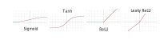
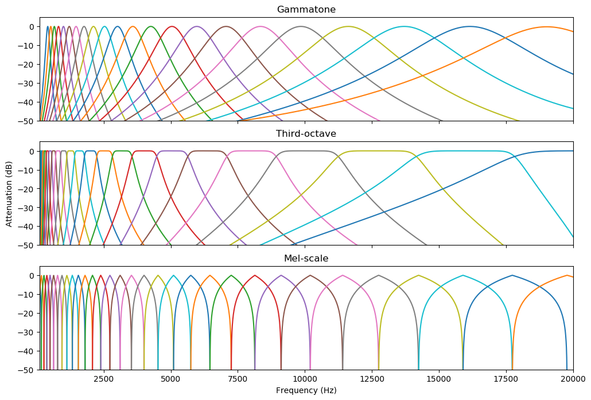
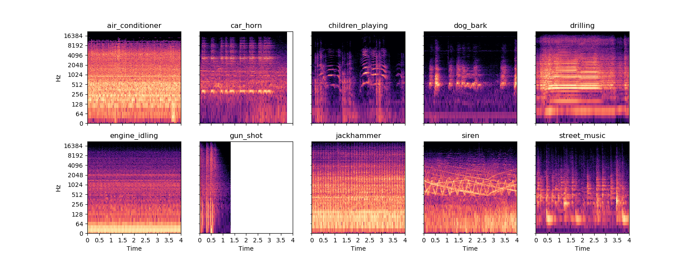
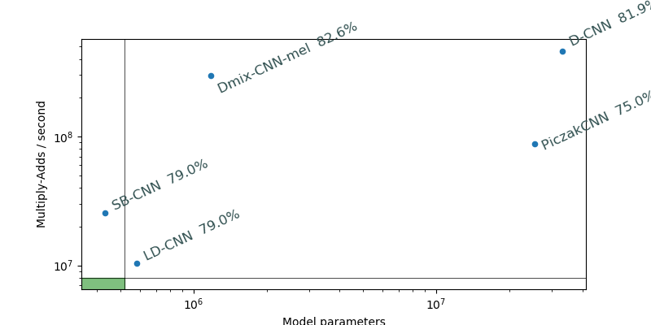
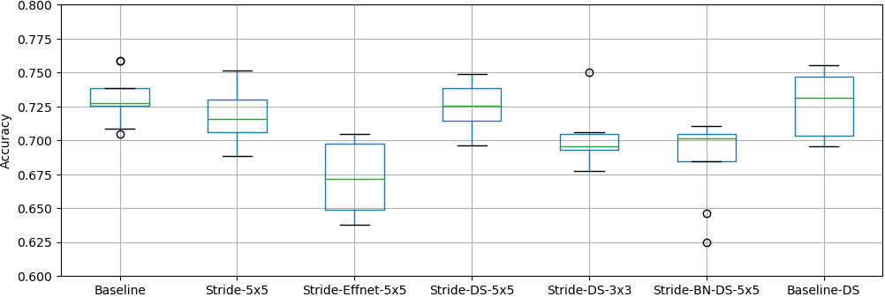
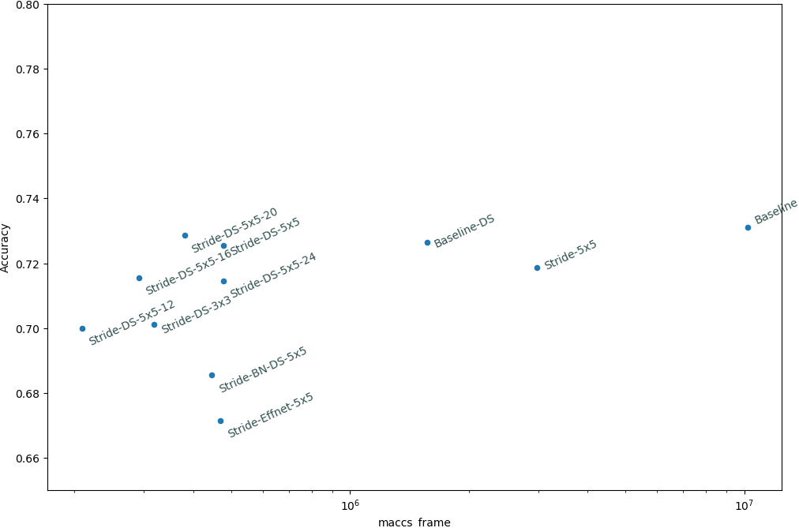
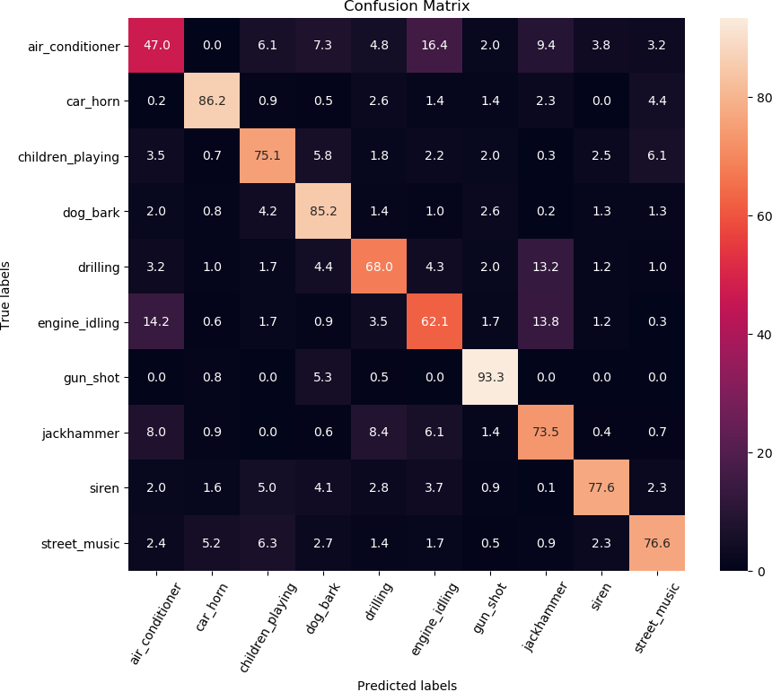
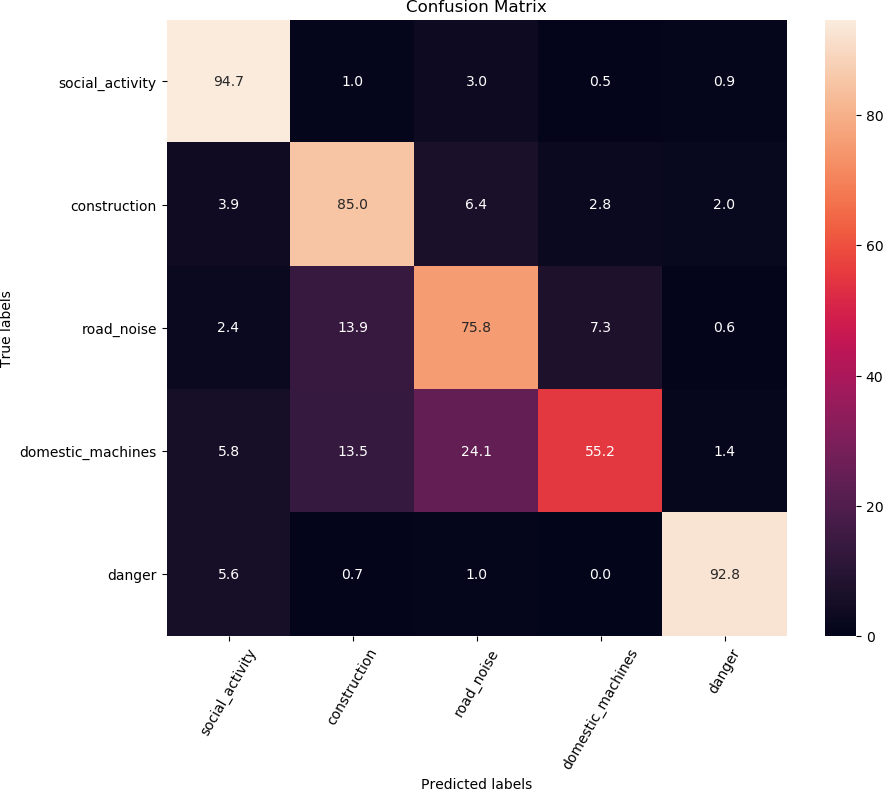

---
documentclass: report
classoption: twoside
title-meta: Environmental Sound Classification on Microcontrollers using Convolutional Neural Networks
author:
- Jon Nordby
keywords:
- Machine Learning
- Convolutional Neural Networks
- Environmental Sound Classification
- Audio Classification
- Embedded Systems
- Wireless Sensor Networks 
---

<!--

Contributions

- Demonstrate an ESC system running on a 5 USD microcontroller.
Resulting in XX% accuracy on Urbansound8k dataset.
- Set of tools for STM32 CubeMX AI
- 

-->

\newpage
# Introduction

<!--

Noise assessment
Challenges.
    Local problem, multiple sources, time-dependent
    Perceptual/subjective evaluation
    Positive sound qualities. Recreational
Increasing noise problem. Urbanization

Track noise level, plan/take corrective action. Visibility
Identifying source. Environmental Sound Classification
Smart-city concept, data-driven

Privacy, GDPR
=> this thesis

-->

<!--
## Measuring noise
Noise level is measured as Sound Pressure Level (SPL), most commonly expressed in decibel.

over the reference of 20*10-6 Pa

Sound levels change 
Environmental noise is measured using continious equivalent sound level ($L_{eq_T}$) over
a some time-period T.
A common time-period used for health is 1 year. 
The equivalent sound level is the sound level that which has the same
energy

It is common to distinguish between noise that occurs in the daytime ($L_{day}$),
and at nighttime ($L_{night}$). 
The yearly 

Sleepers that are exposed to night noise levels above 40dB on average throughout
the year can suffer health effects like sleep disturbance and awakenings.
Above 55dB long-term average exposure, noise can trigger elevated blood pressure and lead to ischemic heart disease.
The WHO has set a Night Noise Guideline level for Europe at 40 dB $L_{night}$.

-->

## Environmental noise

Noise is a growing problem in urban areas, and due to increasing urbanization more and more people are affected.
Major sources of noise include transportation, construction, industry and recreational activities.
The sum of all the noise is referred to as Environmental noise or noise pollution.

Noise pollution over sustained periods of time affects health and well-being in many ways.
Noise can be a source of annoyance and increased stress, cause sleeping disturbance
and increase risk of heart diseases.
WHO has estimated that in Europe 1.6 million healthy life years (Disability-Adjusted Life Years, DALY)
are lost annually due to noise pollution[@WHONoiseBurden2018].
This makes noise pollution the second environmental cause of health problems in Europe, after air pollution.

\begin{figure}[h]
\centering
\includegraphics[width=0.5\textwidth]{./img/noiseseverity.png}
\caption[Health impacts of noise]{Health impacts of noise at different severity levels[@NoiseStressConcept]}
\label{figure:sensornetworks-coding}
\end{figure}

In the EU environmental noise is regulated by Environmental Noise Directive (2002/49/EC)[@EuNoiseDirective].
The purpose of the directive is to:

* Determine people's exposure to environmental noise
* Ensuring that information on environmental noise is available to the public
* Preventing and reducing environmental noise where necessary
* Preserving environmental noise quality where it is good

Member States of the EU are required create noise maps and noise management action plans every 5 years.
These must cover all urban areas, major roads, railways and airports over a certain size.

The noise maps are created using simulation of known noise sources (such as car traffic)
with mathematical sound propagation models, based on estimates for traffic numbers.
These maps only give yearly average noise levels for day, evening and night.

<!--
MAYBE: Add paragraph about noise nuisance.
In addition to the health effects of long-term noise source,
inhabitants can also be bothered by short-term. 

MAYBE: add info about reduced property value

MAYBE: mention occupational noise?
-->

## Noise monitoring with Wireless Sensor Networks

Several cities have started to deploy networks of sound sensors in order to better understand and reduce noise issues.
These sensor networks consist of many sensor nodes positioned in the area of interest,
transmitting the data to a central system for storage and reporting.

Examples of established projects are Dublin City Noise[@DublinCityNoise] with 14 sensors across the city since 2016.
The Sounds of New York City (SONYC)[@SONYC] project had 56 sound sensors installed as of 2018[@SONYC2019],
and the Barcelona Noise Monitoring System[@BarcelonaNoiseMonitoring] had 86 sound sensors[@BarcelonaNoiseMonitoring2018].
The CENSE[@CENSE] projects plans to install around 150 sensors in Lorient, France[@CENSESensor].

![Illustration of how Sounds of New York City[@SONYC-CPS] system combines sensor networks and citizen reporting with data analysis and to present city experts and agencies with a visual interactive dashboard "Noise Mission Control".](./img/SONYC-CPS.png){ width=50% }

To keep costs low and support a dense coverage, the sensor nodes can be designed to operate wirelessly.
Communication is done using wireless radio technologies such as WiFi, GSM, NB-IoT or 6LoWPAN.
The sensor harvests its energy, often using solar power or from streetlights powered at night.
A battery backup allows the sensor to continue operating also when energy is momentarily unavailable.

These sensor networks enable continuous logging of the sound pressure level,
measured in Decibel (dB SPL) over a reference pressure level (typically \num{20e-6}\si{Pa} ).
Since the sound pressure level is continuously varying, it is summarized over a specified time-period
using Equivalent Continuous Sound Level ($L_{eq}$).
Typical measurement resolution are per minute, per second or per 125 ms.
Measurements often use A-weighting to approximate the sensitivity of the human ear at different frequencies.
In Europe sound level sensors are designed to specifications of IEC 61672-1 Sound Level Meters[@IECSoundLevelMeters],
and the standard for North America is ANSI S1.4[@ANSISoundLevelMeters].

Sensors can also provide information that can be used to characterize the noise,
for instance to identify the likely noise sources.
This is desirable in order to understand the cause of noise,
identify which regulations the noise falls under, which actors may be responsible,
and to initiate possible interventions.

This requires much more data than sound level measurements,
making it challenging to transmit the data within the bandwidth and energy budget of a wireless sensor.
The sensor may also capture sensitive information and violate privacy requirements by
recording and storing such detailed data.

To address these concerns several methods for efficiently coding the information
before transmitting to the server have been developed.
Figure \ref{figure:sensornetworks-coding} shows an overview of the different approaches.

\begin{figure}[h]
\centering
\includegraphics[width=1.0\textwidth]{./img/sensornetworks.png}
\caption[Data transmission strategies for noise classification sensor]{Different data transmission strategies for a noise sensor network with noise source classification capability.
A) Sensor sends raw audio data with classification on server.
B) Sensor sends spectrograms as a intermediate audio representation. Classification on server.
C) Sensor sends neural network audio embeddings as intermediate audio representation. Classification on server.
D) Sensor performs classification on device and sends result to server. No audio or intermediate needs to be transmitted.
}
\label{figure:sensornetworks-coding}
\end{figure}

In [@AudioCodingSensorGrid], authors propose a compressed noise profile based on lossy compression of spectrograms.
For 125ms time resolution the bit-rate is between 400 and 1400 bits per second,
however this gave a 5 percentage points reduction in classification accuracy.
This is shown as case B) of Figure \ref{figure:sensornetworks-coding}.

Others have proposed to use neural networks to produce an audio "embedding" inspired
by the success of word embeddings[@rong2014word2vec] for Natural Language Processing.
This is shown as case C) of Figure \ref{figure:sensornetworks-coding}.
In VGGish[@VGGish] model trained on Audioset[@AudioSet]
a 8-bit, 128 dimensional embedding per 1 seconds clips,
leading to a datarate of 1024 bits per second.
$L^3$ (Look, Listen, Learn)[@LookListenLearn] similarly proposed an embedding with 512 dimensions.
The computation of such an embedding generally requires very large models and lots of compute resources.
$EdgeL^3$[@EdgeL3] showed that the $L^3$ model can be compressed by up to 95%,
however the authors state that more work is needed to fit the RAM constraints of desirable sensor hardware.

The minimal amount of data transmissions would be achieved if the detected noise category was sent,
requiring to perform the entire classification on the sensor.
This is shown as case D) of Figure \ref{figure:sensornetworks-coding}.
Such an approach could also eliminate the need to send personally identifiable data to a centralized server.

This motivates the problem statement of this thesis:

> Can we classify environmental sounds directly on a wireless and battery-operated noise sensor?

<!---
Measuring noise

    Terminology. Sound Pressure Level
    Summarizaton. Eq SPL. L10, L90, Lmax, Lpeak
    Spectrograms. Time-frequency characteristics. 1/3 acoustic bands
    Equipment

Sensor Networks for Noise Monitoring

    Research projects.
    Commercially available units.

    Sound sensor. Microphone
    Processing unit. Single-board-computers, microcontrollers
    Connectivity. WiFI, GSM, LoRa. Bandwidth, range, power consumption
    Energy source. Battery and Energy harvesting.
-->

\newpage
# Background

<!---
DROP

Acoustic Scene Classification. Context-dependent compute
Domestic Sound Classification. 
Event detection. Not fine identification in time (onset)
Open-set classification. Novelty detection, clustering
-->

## Machine Learning

Machine Learning is the use of algorithms and statistical models
to effectively perform a task, without having to explicitly program the instructions
for how to perform this task.
Instead the algorithms learn to perform the desired function from provided data.

*Supervised learning* uses a training dataset where each sample is labeled with the correct output.
These labels are normally provided by manual annotation by humans inspecting the data,
a time-intensive and costly process.
In *unsupervised learning*, models are trained without access to labeled data.
This is often used for cluster analysis (automatic discovery of sample groups).

Supervised learning techniques can be used for regression and for classification.
In regression where the goal is to predict a continuous real-valued variable,
and for classification a discrete variable.

### Classification

Classification is a machine learning task where the goal is to
train a model which can accurately predict which class(es) the data belongs to.
Examples use-cases could be to determine from an image which breed a dog is,
to predict from text whether it is positive or negative towards the subject matter
- or to determine from audio what kind of sound is present.

In single-label classification, a sample can only belong to a single class. 
In closed-set classification, the possible class is one of N predetermined classes.
Many classification problems are treated as single-label and closed-set.

`TODO: image of classification problem`

Metrics are used to evaluate how well the model performs at its task.
Common metrics for classification include:
*Accuracy* - the ratio of correct predictions to total predictions,
*Precision* - number of correct positive results divided by the total number of positive predictons,
*Recall* (Sensitivity) - number of correct positive results divided by the number of predictions that should have been positive.

For a given model there will be a tradeoff between Precision and Recall.
For binary classification, the range of possible tradeoffs can be evaluated using a
Receiver-Response Curve (ROC).

<!--
SKIP
- class im/balance
-->

### Training process

The goal of the classification model is to make good predictions *on unseen data*.
The samples available in the dataset only represent some particular examples
of this underlying (hidden) distribution of data. 
Care must be taken to avoid learning peculiarities that are specific to the training samples
and not representative of general patterns.
A model that fails this generalization criteria is often said to be *overfitting*,
while a model that fails to learn any predictive patterns is said to be *underfitting*.

<!-- MAYBE: Mention bias/variance tradeoff?  -->

To address this challenge the dataset is divided into multiple subsets that have different purposes.
The *training set* is data that the training algorithm uses to optimize the model on.
To estimate how well the model generalizes to new unseen data,
predictions are made on the *validation set*. 
The final performance of the trained model is evaluated on a *test set*,
which has not been used in the training process.
To get a better estimate of how the model performs K-fold cross validation can be used,
where K different training/validation splits are attempted.
K is usually set to a value between 5 and 10.
The overall process is illustrated in Figure \ref{figure:crossvalidation}.

One common style of supervised learning processes is to:
start with a base model and initialize its parameters (often randomly),
then make predictions using this model, compare these predictions with the labels to compute
an error, and then update the parameters in order to attempt to reduce this error.
This iterative process is illustrated in \ref{figure:training-inference}.

*Hyperparameters* are settings (parameters) used in the training process that
are set, but not used as optimization during training.
Hyperparameters can be chosen by selecting different candidate settings,
training model(s) to completion with these settings,
and evaluating performance on the validation set.
When performed systematically this is known as a hyperparameter search.
<!-- MAYBE: include
Common strategies include random search, combinatorial (gridsearch) and Baysian Optimization.
-->

Once training is completed, the predictive model with the learned parameters can be used on new data. 

## Neural Networks

Artificial Neural Networks are a family of machine learning methods,
loosely inspired by the biological neurons in the brains of humans and other animals.
Some of the foundations such as the Perceptron[@Perceptron] dates back to the 1950s,
but it was not until around 2010 that neural networks started to become
the preferred choice for many machine learning applications.

### Multi-Layer Perceptron

A basic and illustrative type of Neural Network is the Multi-Layer Perceptron (MLP),
shown in Figure \ref{fig:multilayer-perceptron}.
It consists of an input layer, one or more hidden layers, and an output layer.

\begin{figure}[h]
  \centering
     \includegraphics[]{./img/multilayer-perceptron.png}
\caption{Multi-Layer Perceptron with 2 hidden layers
}
\label{fig:multilayer-perceptron}
\end{figure}

\begin{figure}[h]
  \centering
    \includegraphics[]{./img/artificial-neuron.png}
\caption{Computational principle of an artificial neuron
}
\label{fig:artificial-neuron}
\end{figure}

Each layer consists of a number of neurons.
The neurons of one layer are connected to each of the neurons in the preceding layer.
This type of layer is therefore known as a fully-connected layer.
The input to the network is a 1-dimensional vector.
If the data is multi-dimensional (like an image) is to be used,
it must be flattened to a 1-D vector.

Each neuron computes its output as a weighted sum of the inputs,
offset by a bias and followed by an activation function $f$,
as illustrated in \ref{fig:artificial-neuron}.
In the simplest case the activation function is the identity function.
This lets the layer express any linear function.

Making predictions with a neural network is done by applying the data
as inputs to the first layer, then computing all the following layers until the final outputs.
This is often called *forward propagation*.

### Activation functions

To be able to express non-linear relationships between input and output,
non-linear activation functions are applied.
When non-linearity is used, a neural network becomes a universal function approximator[@cybenko1989approximation].

Commonly used general-purpose non-linear activation functions are tanh and ReLu[@ReLu].
Sigmoid and softmax are commonly used at the output stage
of a neural network for classification, as they convert the input to a probability-like $(0,1)$ range.
Sigmoid is used for binary classification, and Softmax for multi-class classification.
To get a discrete class from these continuous probability values, a decision function is applied.
The simplest decision function for single-label multi-class classification is to take the largest value,
using the argmax function.

An illustration of the mentioned activation functions can be seen in Figure \ref{fig:activation-functions}.

Increasing the number of neurons and the number of hidden layers
increases the capacity of the network to learn more complex functions.

<!--
The derivative of tanh quickly gets close to 0 for large and small inputs.
This can cause a vanishing gradient problem.

The derivative of ReLu is 0 for inputs smaller than 0.
This can cause 'dead' neurons, where
Many variations on the base ReLu have been proposed to address this issue, such as
Leaky ReLU[@LeakyReLu], Parametric ReLu (PReLU)[@PReLu] and Exponential Linear Unit (ELU)[@ELU].
-->

### Training Neural Networks

Neural Networks are trained through numerical optimization of an objective function (loss function).
For supervised learning the standard method is mini-batch Gradient Descent with Backpropagation.

For classification the cross-entropy (log loss) function is often applied.
As predicted probability of the true class gets close to zero, the (negative) log-loss goes towards infinity.
Figure \ref{fig:log-loss}

`TODO: picture of loss in binary cross entropy`
Categorical cross-entropy is an extension of binary cross-entropy to multiple classes.
Other loss functions are Logistic Loss, Mean Squared Error and Mean Absolute Error.

Making predictions with a forward pass of the neural network
and computing the loss function allows to estimates how well or how poorly
the current model performs.
In order to find out how the model parameters should be changed in order to perform better,
*Gradient Descent* is applied.
The gradient of a function expresses how much and in which direction its output varies
with small changes to its inputs.
This is computed as the partial derivative of the function.

<!--
MAYBE: mention momentum
[@SaddlePointNeuralNetworks]
-->

`TODO: image of 1-D loss landscape and Gradient Descent`

The key to calculating the gradients in a multi-layer neural networks
is *backpropagation*[@BackpropagationNeuralNetworks].
Backpropagation works by propagating the error in the last layers "back" towards the input,
using the partial derivative with respect to the inputs from the layer before it. 
This makes it possible to compute the gradients for each of the weights (and biases) in the network[@EfficientBackProp, ch 1.3].
Once the gradients are known, the weights are updated by taking a step in the negative direction of the gradient.
The step is kept small by multiplying with the *learning rate*,
a hyperparameter in the range of $\num{e-7}$ to $\num{e-2}$.
Too small learning rates can lead to the model getting stuck in bad minima,
while too large learning rates can cause training to not converge[@EfficientBackProp, ch 1.5.1].

In *mini-batch* Gradient Descent the training data is processed in multiple fixed size batches of data,
and the loss function and model parameters updates are computed per batch.
This means that not all the training data has to be kept in memory at the same time,
which allows to train on very large datasets.
The batch size is a hyperparameter, and has to be set high enough for the batch loss
to be a reasonable estimate of the loss on the full training set,
but small enough for the batch to fit into memory.

One pass through the entire training set is called an *epoch*,
and training normally consists of many epochs.

The mini-batch Gradient Descent optimization with backpropagation
can be summarized in the following procedure:

1. Sample a mini-batch of data
2. Forward propagate the data to compute output probabilities, calculate loss
3. Backpropagate the errors to compute error gradients in entire network
4. Update each weight by moving a small amount against the gradient
5. Go to 1) until all batches of all epochs are completed

Gradient Descent is not guaranteed to find a globally optimal minima,
but with suitable choices of hyperparameters can normally find local minima that are good-enough.
It has also been argued that a global optimum on the training set might
not be desirable, as it is unlikely to generalize well[@LossSurfaceNeuralNetworks].

<!--
MAYBE: mention One-hot encoding?
-->

<!--
Backpropagation algorithm in 4 steps
http://neuralnetworksanddeeplearning.com/chap2.html#the_backpropagation_algorithm
-->

<!--
Computes the partial-derivative for a single training example
Average over samples in the batch

Requires continious, smooth loss function, convex (only one minimum)
Large steps when gradient is large, smaller steps when gradient is small
Backpropagation requires the derivatives of activation functions to be known at network design time.
-->

<!--
Vanishing gradient
Exploding gradient

Too small and might not overcome saddle points
Too big and might oscillate and always overshoot minimum

[@BatchNormalization]
Regularization
Dropout
-->

### Convolutional layers 

Convolutional layers are an alternative to fully-connected layers that allows
for 2D input and that can exploits the spatial relationship in such data.

In addition to the width and height the input also has a third dimension, the number of *channels*.
The different channels can contain arbitrary kinds of data,
but common for the first layer would be 3 channels with an RGB color image,
or 1 channel for grayscale images or audio spectrogram.

To perform 2D convolution, a filter (or *kernel*) of fixed size $K_w$x$K_h$ is swept across the 2D input of a channel.
For each location, the kernel multiplies the input data with the *kernel weights* and sums to a single value
that becomes the output value. This is shown in Figure \ref{fig:convolution-2d}.

\begin{figure}[h]
  \centering
    \includegraphics[width=1.0\textwidth]{./img/convolution-2d.png}
\caption{2D convolution for a single channel.
Red outlines show how the filter moves across the input image.
Filter weights shown in red numbers, input numbers in blue.
Green dots illustrate locations of outputs with respect to inputs.
}
\label{fig:convolution-2d}
\end{figure}

This convolution process allows to express many useful transformations on 2D data,
by simply selecting different weights in the kernel.
Simple examples are edge detection (horizontal/vertical/diagonal) or smoothening filters (mean/Gaussian). 
And since the kernels weights in a convolutional layer are trained,
they learn to detect local features specific to the training data.

<!-- TODO: image of convolved image -->

With multiple input channels, the same kernel is applied over all the input channels,
and all the results at one location, and the bias, are summed together to become the output.
Multiple convolution filters are normally used per layer,
to produce $M$ new output channels with different features from the $N$ input channels.

In Figure \ref{fig:convolution-2d} each location of the kernel has the entire kernel inside the input area.
This is called convolution with "valid" padding,
and the resulting output will be smaller by $\left\lceil{k/2}\right\rceil$ on each side,
where $k$ is the kernel size.
If the input is instead padded by this amount when moving the kernel, the output will be the same size as the input.
This is called convolution with "full" padding.

<!--
`TODO: image of valid versus full convolution` 
MAYBE: mention that conv and fully-connected can be coverted
-->

The number of learnable parameters in a 2D convolutional layer with bias is
$P_{conv} = M(K_wK_h + 1)$, with $M$ filters and a kernel of size $K_w$x$K_h$.
Commonly used kernel sizes are 3x3 to 7x7.

In the fully-connected layer there was $(N+1) \times M$ parameters for $N$ inputs and $M$ neurons.
For 2D images $N=height \times width \times channels$, so even for small image grayscale inputs (N=100x100x1=10000)
a convolutional layer has much fewer parameters.

The computational complexity of a Neural Network is often measured
in the number of Multiply-Accumulate operations (MACC).

The computational complexity of a 2D convolution is $O_{conv} = WHNK_wk_hM$,
with input height $H$, input width $W$, $N$ input channels, $M$ output channels$
and a 2D kernel of size $K_w$x$K_h$.

### Convolutional Neural Network

![The LeNet-5 architecture illustrated. From the original paper[@lecun1998gradient] \label{fig:lenet-5}](./img/lenet5.png)

A Convolutional Neural Network (CNN) is a neural network that uses convolutional layers
in addition to (or instead of) fully-connected layers.
One of the early examples of a CNN model was LeNet5 (1998)[@lecun1998gradient],
which was successfully applied to recognition of handwritten digits.
As seen in Figure \ref{fig:lenet-5}, the architecture uses
two convolutional layers (with subsampling after each),
followed by two fully-connected layers and then the output layer.

Architectures with more layers based on very similar structures have been
shown to work well also on more complex tasks, like VGGNet (2014)[@VGGNet]
on the 1000-class image recognition task ImageNet[@ImageNet].

### Subsampling

Besides the convolution filters, the other critical part that makes CNNs
effective is to gradually subsample the data as it moves through the convolutional layers.
This forces the model to learn bigger (relative to the original input space) 
and more complex features (patterns of patterns) in later layers.
<!-- TODO: ref-->

A pooling layer is one way of accomplishing this,
and was used in the LeNet5 and VGGNet architectures.
A 2D pooling operation has $K_w$x$K_h$ sized filter,
and scans over the image width and height.
The stride is normally set to the same size of the operation.
Each channel is processed independently.
It outputs 1 element for each scanned location in the image.
With *average pooling*, the output is the average value of the input.
With *max pooling*, the output is the maximum value of the input (Figure \ref{fig:maxpooling}).

<!--
Pooling said to help model be translation invariant.
-->

Another way of subsampling is by increasing the stride of the convolutions[@AllConvolutionalNet].
If a kernel has a stride of 2 (as in Figure \ref{fig:strided-convolution}),
then the output of of the convolution will be reduced by half.
Striding is usually applied in the first convolution in a layer,
and reduces the number of computations compared to pooling because fewer inputs need to be computed. 

Striding was used to replace most of the pooling operations in ResNet[@ResNet] (2015),
which beat human-level performance on the ImageNet task.

<!--
MAYBE: equation for operations for strided convolution 
-->

### Spatially Separable convolution

While CNNs have relatively low number of parameters, compared to fully-connected layers,
the convolutional kernels still require a lot of computations.
Several alternative convolution layers have been proposed to address this.

In a spatially separable convolution, a 2D convolution is factorized into two convolutions with 1D kernels.
First a 2D convolution with $1 x K_h$ kernel is performed, followed by a 2D convolution with a $K_w x 1$ kernel,
as illustrated in Figure \ref{fig:spatially-separable-convolution}. The number of operations is

$$
O_{ss} = HWNMK_w + HWNMK_h = HWNM(K_w+K_h)
$$

The number of computations and parameters compared with regular 2D convolutions
is $(K_wK_h)/(K_w+K_h)$ times fewer.
For example with $K_w=K_h=3$, $9/6=1.5$ and with $K_w=K_h=5$ = $25/10=2.5$. 

### Depthwise Separable convolution

![Input/output relationship of standard 3x3 convolution versus Depthwise Separable convolution. Image based on illustrations by Yusuke Uchida[@ConvolutionsIllustrated] \label{fig:depthwise-separable-convolution}](./img/depthwise-separable-convolution.png)

While a standard convolutional layer performs a convolution over both channels and the spatial extent
a Depthwise Separable convolution splits this into two convolutions:
First a *Depthwise Convolution* over the spatial extent only,
followed by a *Pointwise Convolution* over the input channels.
The diffence is illustrated in Figure \ref{fig:depthwise-separable-convolution}.

The pointwise convolution is sometimes called a 1x1 convolution,
since it is equivalent to a 2D convolution operation with a 1x1 kernel. 

<!-- XXX: add numbering to equations and reference them -->
<!-- XXX: put this into one equation environment, so image doe not cut through -->

$$ O_{pw} = HWNM $$
$$ O_{dw} = HWNK_wK_h $$
$$ O_{ds} = O_{pw} + O_{dw} = HWN(M + K_wK_h) $$

This factorization requires considerably fewer computations compared to full 2D convolutions.
For example, with kernels size $K_w=K_h=3$ and $M=64$ channels, it takes approximately $7.5x$ fewer operations.

<!---
SKIP
- Residual connections/networks
- Grouped convolutions. HWNK²M/G
? Global Average Pooling
"Fully convolutional neural networks". Only Conv operations. Used by ResNet.
-->

### Efficient CNNs for Image Classification

The development of more efficient Convolutional Neural Networks for
image classification have received a lot of attention over the last few years.
This is especially motivated by the ability to run models
that give close to state-of-the-art performance on mobile phones and tablets.
Since spectrograms are 2D inputs that are similar to images, it is possible that some of these
techniques can transfer over to Environmental Sound Classification.

SqueezeNet[@SqueezeNet] (2015) focused on reducing the size of model parameters.
It demonstrated AlexNet[@AlexNet]-level accuracy on ImageNet challenge using 50x fewer parameters,
and the parameters can be compressed to under 0.5MB in size compared to 240MB for AlexNet.
It replaced most 3x3 convolutions in a convolution block with 1x1 convolutions,
and reduce the number of channels using "Squeeze" layers consisting only of 1x1 convolutions.
The paper also found that a residual connection between blocks increased model performance
by 2.9% without adding parameters.

Mobilenets[@Mobilenets] (2017) focused on reducing inference computations by
using Depthwise separable convolutions.
A family of models with different complexity was created using two hyperparameters:
a width multiplier $\alpha$ (0.0-1.0) which adjusts the number of filters in each convolutional layer,
and the input image size.
On ImageNet, MobileNet-160 $\alpha=0.5$ with 76M MACC performs better than SqueezeNet with 1700M MACC,
a 22x reduction. The smallest tested model was 0.25 MobileNet-128, with 15M MACC and 200k parameters.

![Convolutional blocks of Effnet, ShuffleNet and Mobilenet. Illustration based on Effnet paper[@Effnet]](./img/conv-blocks-imagenets.png)

Shufflenet[@Shufflenet] (2017) uses group convolutions in order to reduce computations.
In order to mix information between different groups of convolutions it introduces
a random channel shuffle.

SqueezeNext[@SqueezeNext] (2018) is based on SqueezeNet but
uses spatially separable convolution (1x3 and 3x1) to improve inference time.
While the MACC count was higher than MobileNet, they claim better inference
time and power consumption on their simulated hardware accelerator.

Effnet[@Effnet] (2018) also uses spatial separable convolutions,
but additionally performs the downsampling in a separable fashion:
first a 1x2 max pooling after the 1x3 kernel,
followed by 2x1 striding in the 3x1 kernel.
Evaluated on CIFAR10 and Street View House Numbers (SVHN) datasets
it scored a bit better than Mobilenets and ShuffleNet. 

\newpage
## Audio Classification

In Audio Classification, the predictive models operate on audio (digital sound).
Example tasks are wake-word or speech command detection in Speech Recognition,
music genre or artist classification in Music Information Retrieval
- and classification of environmental sounds.

### Digital sound

Physically, sound is a variation in pressure over time.
To process the sound with machine learning, it must be converted to a digital format.
The acoustic data is first converted to analog electric signals by a microphone and
then digitized using an Analog-to-Digital-Converter (ADC),
as illustrated in Figure \ref{figure:audio-acquisition}.

In the digitization process, the signal is quantized in time at a certain sampling frequency,
and the amplitude quantized at a certain bit-depth.
A typical sampling frequency is 44100 Hz and bit-depth 16 bit,
as used in the Audio CD format[@AudioCDspecification].
With such parameters the majority of human perceivable information in the acoustic sound is captured.
In this representation sound is a one dimensional sequence of numbers, sometimes referred to as a *waveform*.
This is the format utilized by case A) in Figure {figure:sensornetworks-coding} from the introduction.

Digital sound can be stored uncompressed (example format: WAV PCM[@WAVspecification]),
using lossless compression (FLAC[@FLACHomepage])
or using lossy compression (MP3[@MP3Standard]).
Lossy compression removes information that is indistinguishable to the human ear
and can therefore compress better than lossless.
It however adds compression artifacts, and is best avoided for machine learning tasks.

Recordings can have multiple channels of audio but for machine learning on audio
single-channel data (mono-aural) is still common.

### Spectrograms

Sounds of interest often have characteristic patterns not just in time (temporal signature)
but also in frequency content (spectral signature).
Therefore it is common to analyze audio in a time-frequency representation (a *spectrogram*).

A common way to compute a spectrogram from an audio waveform is by using the Short Time Fourier Transform (STFT)[@ShortTimeFourierTransformJos].
The STFT operates by splitting the audio up in short consecutive chunks,
and computing the Fast Fourier Transform (FFT) to estimate the frequency content for each chunk.
To reduce artifacts at the boundary of chunks, they are overlapped (typically by 50%)
and a window function (such as the Hann window) is applied before before computing the FFT.
With the appropriate choice of window function and overlap, the STFT is invertible[@STFTmodifications].

`FIXME: image of windowing / STFT process`
<!--
Inspiration for TODO: image, https://dsp.stackexchange.com/questions/19311/stft-why-overlapping-the-window
-->

There is a trade-off between frequency (spectral) resolution and time resolution with the STFT.
The longer the FFT window the better the frequency resolution,
but the poorer the temporal resolution.
For speech a typical choice of window length is 20 ms.
Similar frame lengths are often adopted for acoustic events.
The STFT returns complex numbers describing phase and magnitude of each frequency bin.
A spectrogram squaring the absolute of the magnitude, and discards the phase information.
The lack of phase information means that the spectrogram is not strictly invertible,
though estimations exist[@GriffinLimSpectrogramInversion][@MCNNSpectrogramInversion].

### Mel-spectrogram

The more complex the input to a machine learning system is,
the more processing power is needed both for training and for inference.
Therefore one would like to reduce the dimensions of inputs as much as possible.
A STFT spectrogram often has considerable correlation (redundant information) between adjacent frequency bins,
and is often reduced to 30-128 frequency bands using a filter-bank.
Several different filter-bank alternatives have been investigated for audio classification tasks,
such as 1/3 octave bands, the Bark scale, Gammatone and the Mel scale. <!-- TODO: reference`-->
All these have filters spacing that increase with frequency, mimicking the human auditory system. <!-- TODO: reference -->
See Figure \ref{figure:filterbanks}.

The Mel scaled filters is commonly used for audio classification. <!-- TODO: reference -->
The spectrogram that results for applying a Mel-scale filter-bank is often called a Mel-spectrogram.

`TODO: image of mel-spectrogram`

Mel-Filter Cepstral Coefficients (MFCC) is a feature representation
computed by performing a Discrete Cosine Transform (DCT) on a mel-spectrogram.
This further reduces dimensionality to just 13-20 bands with low correlation between each band.
MFCC have been very popular in speech recognition tasks[@anusuya2011front],
however in general sound classification tasks mel-spectrograms tend to perform better[@huzaifah2017comparison][@StowellBirdUnsupervisedFeatureLearning]. 

### Normalization

Audio has a very large dynamic range.
The human hearing has a lower threshold of hearing down to $20\mu\text{Pa}$ (0 dB SPL)
and a pain threshold of over 20 Pa (120 dB SPL), a difference of 6 orders of magnitude[@smith1997scientist, ch.22].
A normal conversation may be 60 dB SPL and a pneumatic drill 110 dB SPL, a 4 orders of magnitude difference.
It is common to compress the range of values in spectrograms by applying a log transform.

In order to center the values, the mean (or median) of the spectrogram can be removed.
Scaling the output to a range of 0-1 or -1,1 is also sometimes done.
These changes have the effect of removing amplitude variations,
forcing the model to focus on the patterns of the sound regardless of amplitude.

`TODO: image of normalized mel-spectrogram. Or feature distribution of datasets w/without normalization?`

### Analysis windows

When recording sound, it forms a continuous, never-ending stream of data.
The machine learning classifier however generally needs a fixed-size feature vector. 
Also when playing back a finite-length recording, the file may be many times longer than
the sounds that are of interest.
To solve these problems, the audio stream is split up into analysis windows of fixed length,
that are classified independently.
The length of the window is typically a little longer than the longest target sound.
The windows can follow each-other with no overlap,
or move forward by a number less than the window length (overlap).
With overlap a target sound will be classified a couple of times,
at a slightly different position inside the analysis window each time.
This can improve classification accuracy.

A short analysis window has the benefit of reducing the feature size of the classifier,
which uses less memory and possibly allows to reduce the model complexity,
and in turn allow to make better use of a limited dataset. 

When the length of audio clips is not evenly divisible by length of analysis windows,
the last window is zero padded.

### Weak labeling

Sometimes there is a mismatch between the desired length of analysis window,
and the labeled clips available in the training data.
For example a dataset may consist of labeled audio clips with a length of 10 seconds,
while the desired output is every second.
When a dataset is labeled only with the presence of a sound at a coarse timescale,
without information about where exactly the relevant sound(s) appears
it is referred to as *weakly annotated* or *weakly labeled* data[@ComputationalAnalysisSound, ch 14.2.4.1].

If one assumes that the sound of interest occurs throughout the entire audio clip,
a simple solution is to let each analysis window inherit the label of the audio clip as-is,
and to train on individual analysis windows.
If this assumption is problematic, the task can be approached as a Multiple Instance Learning (MIL) problem.
Under MIL each training sample is a bag of instances (in this case, all analysis windows in an audio clip),
and the label is associated with this bag[@MultipleInstanceLearning2008].
The model is then supposed to learn the relationship between individual instances and the label.
Several MIL techniques have been explored for audio classification and audio event detection[@WeaklyLabeledAEDMIL][@AdaptivePoolingWeaklyLabeled][@morfi2018dcase].

### Aggregating analysis windows

When evaluating on a test-set where audio clips are 10 seconds,
but the model classifies analysis windows of 1 second
the individual predictions must be aggregated into one prediction for the clip.

A simple technique to achieve this is *majority voting*,
where the overall prediction is the class that occurs most often across individual predictions.

With *soft voting* or *probabilistic voting*,
the probabilities of individual predictions are averaged together,
and the output prediction is the class with overall highest probability.

<!-- TODO: image showing how voting is performed --> 

### Data augmentation

Access to labeled samples is often limited, because it is expensive to acquire.
This can be a limiting factor for reaching good performance using supervised machine learning.

Data Augmentation is a way to synthetically generate new labeled samples from existing ones,
in order to expand the effective training set.
A simple form of data augmentation can be done by modifying the sample data slightly.
Common data augmentation techniques for audio include Time-shift, Pitch-shift and Time-stretch.
These are demonstrated in Figure \ref{figure:dataaugmentations}.

Mixup[@Mixup] is another type of data augmentation technique
where two samples from different classes are mixed together to create a new sample.
A mixup ratio $\lambda$ controls how much the sample data is mixed,
and the labels of the new sample is mixed in the same way.

$$
\begin{aligned}
\tilde{x} &= \lambda x_i + (1 - \lambda)x_j & \text{  where } x_i, x_j \text{are raw input vectors} \\
\tilde{y} &= \lambda y_i + (1 - \lambda)y_j & \text{  where } y_i, y_j \text{are labels one-hot encoded}
\end{aligned}
$$

The authors argue that this encourages the model to behave linearly in-between training examples.
It has been shown to increase performance on audio tasks[@ESC-mixup][@AclNet][@Mixup-ASC].

Data augmentation can be applied either to the raw audio waveform,
or to preprocessed spectrograms.

<!--
Other data augmentation:

Frequency response change
Dynamic range compression
Cutout
-->

### Efficient CNNs for Speech Detection

Speech detection is a big application of Audio Classification,
and there has been research focused on efficient models for use
in smartwatches, mobile devices and smart-home devices (Amazon Alexa et.c.).
In the Keyword Spotting (KWS) the goal is to detect a keyword or phrase that
indicates that the user wants to enable speech control.
Being an audio classification task that is often done on low-power microcontrollers,
some of the explored techniques may transfer over to the Environmental Sound Classification task.

In [@sainath2015convolutional] (2015) authors evaluated variations of
small-footprints CNNs for keyword spotting. They found that using large strides in time or frequency 
could be used to create models that were significantly more computationally effective.

In the "Hello Edge"[@HelloEdge] paper (2017),
different models were evaluated for keyword spotting on microcontrollers.
Included were most standard deep learning model architectures
such as Deep Neural Networks (DNN), Recurrent Neural Networks and Convolutional Neural Networks.
They found that Depthwise Separable Convolutional Neural Network (DS-CNN) provided the best
accuracy while requiring significantly lower memory and compute resources than other alternatives.
Models were evaluated with three different performance limits.
Their "Small" version with under 80KB, 6M ops/inference achieved 94.5% accuracy on the Google Speech Command dataset.
A DNN version was demonstrated on a high-end microcontroller (ARM Cortex M7 at 216 Mhz) using CMSIS-NN framework,
running keyword spotting at 10 inferences per second while utilizing only 12% CPU (rest sleeping).

FastGRNN[@FastGRNN] (2018) is a Gated Recurrent Neural Network designed
for fast inference on audio tasks on microcontrollers.
It uses a simplified gating architecture with residual connection,
and uses a three-stage training schedule that
forces weights to be quantized in a sparse and low-rank fashion. 
When evaluated on Google Speech Command Set (12 classes),
their smallest model of 5.5 KB achieved 92% accuracy
and ran in 242 ms on a low-end microcontroller (ARM Cortex M0+ at 48 Mhz).

\newpage
## Environmental Sound Classification

`TODO: introduction paragraph`

### Datasets
\label{chapter:datasets}

The Urbansound taxonomy[@UrbanSound8k, ch 2] is a proposed taxonomy of sound sources,
developed based on analysis of noise complaints in New York city between 2010 and 2014.
The same authors also compiled the Urbansound dataset[@UrbanSound8k, ch 3],
based on selecting and manually labeling content from the Freesound[@Freesound] repository.
10 different classes from the Urbansound taxonomy were selected and
1302 different recordings were annotated, for a total of 18.5 hours of labeled audio. 
A curated subset with 8732 audio clips of maximum 4 seconds is known as *Urbansound8k*.

YorNoise[@medhat2017masked] is a collection of vehicle noise.
It has a total of 1527 samples, in two classes: road traffic (cars, trucks, buses) and rail (trains).
The dataset follows the same design as Urbansound8k,
and can be used standalone or as additional classes to Urbansound8k.

ESC-50[@ESC-50] is a small dataset of environmental sounds,
consisting of 2000 samples across 50 classes from 5 major categories.
The dataset was compiled using sounds from Freesound[@Freesound] online repository.
A subset of 10 classes is also proposed, often called ESC-10.
Human accuracy was estimated to be to 81.30% on ESC-50 and
95.7% on ESC-10[@ESC-50, ch 3.1].
The Github repository for ESC-50[@ESC-50-Github] contains a comprehensive summary
of results on the dataset, with over 40 entries.
As of April 2019, the best models achieve 86.50% accuracy,
and all models with over 72% accuracy use some kind of Convolutional Neural Network.

AudioSet [@AudioSet] is a large general purpose ontology of sounds with 632 audio event classes.
The accompanying dataset has over 2 million annotated clips based on sound from Youtube videos.
Each clip is 10 seconds long. 527 classes from the ontology are covered.

In DCASE2019 challenge (in progress, ends July 2019) task 5[@DCASE2019Task5]
audio clips containing common noise categories are to be tagged.
The tagging is formulated as a multi-label classification on 10 second clips.
The dataset[@SONYC-UST] has 23 fine-grained classes across 8 categories
with 2794 samples total.
The data was collected from SONYC noise sensor network in New York city. 

Several earlier DCASE challenge tasks and datasets
have been on related topics to Environmental Sound Classification,
such as Acoustic Scene Detection[@DCASE2017Task1],
general-purpose tagging of sounds[@DCASE2018Task2],
and detection of vehicle related sounds[@DCASE2017Task4].

<!--
DROPPED: table with dataset statistics

TUT Sound Events 2017[@TUT2017dataset] is a dataset used for the task
"Sound event detection in real life audio" for the
Detection and Classification of Acoustic Scenes and Events (DCASE) challenge in 2017.
-->

### Spectrogram-based models
\label{chapter:esc-models}

Many papers have used Convolutional Neural Networks (CNN) for Environmental Sound Classification.
Approaches based on spectrograms and in particular log-scaled melspectrogram being the most common.

PiczakCNN[@PiczakCNN] in 2015 was one of the first applications of CNNs to the Urbansound8k dataset.
It uses 2 channels of log-melspectrograms, both the plain spectrogram values
and the first-order difference (delta spectrogram).
The model uses 2 convolutional layers, first with size 57x6 (frequency x time) and then 1x3,
followed by two fully connected layers with 5000 neurons each.
The paper evaluates short (950 ms) versus long (2.3 seconds)
analysis windows, and majority voting versus probability voting.
Performance on Urbansound8k ranged from 69% to 73%.
It was found that probability voting and long windows perform slightly better[@PiczakCNN].
 
![Architecture of Piczak CNN, from the original paper [@PiczakCNN]. The model input has two channels: the spectrogram magnitude (light blue) and a first-order difference "delta" of the spectrogram (purple)) \label{figure:piczak-cnn}](./img/piczak-cnn.png)

SB-CNN[@SB-CNN] (2016) is a 3-layer convolutional with uniform 5x5 kernels and 4x2 max pooling.
The paper also analyzes the effects of several types of data augmentation on Urbansound8k.
including Time Shift, Pitch Shift, Dynamic Range Compression and Background Noise.
With all augmentations, performance on their model raised from 72% to 79% classification accuracy.
However time-stretching and pitch-shifting were the only techniques that
consistently gave a performance boost across all classes.

D-CNN[@D-CNN] (2017) uses feature representation and model architecture that largely follows that of PiczakCNN,
however the second layer uses dilated convolutions with a dilation rate of 2. 
With additional data augmentation of time-stretching and noise addition,
this gave a performance of up to 81.9% accuracy on Urbansound8k.
LeakyRelu was found to perform slightly better than ReLu which scored 81.2%.

A recent paper investigated the effects of mixup for data augmentation[@ESC-mixup].
Their model uses 4 blocks of 2 convolutional layers each, with each block followed by max pooling.
The second and third blocks together form a spatially separated convolution:
the second block uses two 3x1 convolutions, and third block uses two 1x5 convolutions. 
On mel-spectrograms the model scored 74.7% on Urbansound8k without data augmentation,
77.3% with only mixup applied,
and 82.6% when time stretching and pitch shift was combined with mixup.
When using Gammatone spectrogram features instead of mel-spectrogram
performance increased to 83.7%, which seems to be state-of-the-art as of April 2019.

### Audio waveform models 

Recently approaches that use the raw audio waveform as input have also been documented.

![EnvNet[@EnvNet] architecture, using raw audio as input. \label{figure:envnet}](./img/envnet.png)

EnvNet[@EnvNet] (2017) used 1D convolutions in order to learn a 2D spectrogram-like representation
which is then classified using standard 2D convolutional layers.
The architecture is illustrated in Figure \ref{figure:envnet}.
They show that the resulting spectrograms have frequency responses with
a shape similar to mel-spectrograms.
The model achieves a 66.3% accuracy score on Urbansound8k[@EnvNet2] with raw audio input.

In [@VeryDeepESC], authors evaluated a number of deep CNNs using only 1D convolutions.
Raw audio with 8kHz sample rate was used as the input.
Their 18 layer model (M18) got a 71% accuracy on Urbansound8k,
and the 11 layer version (M11) got 69%.

EnvNet2[@EnvNet2] (2018) is like EnvNet but with 13 layers total instead of 7,
and using 44.1 kHz input sample-rate instead of 16 kHz.
Without data augmentation it achieves 69.1% accuracy on Urbansound8k.
When combining data augmentation with a technique similar to mixup called between-class examples,
the model is able to reach 78.3% on Urbansound8k.

### Resource efficient models

There are also a few studies on Environmental Sound Classification (ESC)
that explicitly target making resource efficient models, measured
in number of parameters and compute operations.

WSNet[@WSNet] is a 1D network on raw audio designed for efficiency.
It proposes a weight sampling approach for efficient quantization of weights to
reache an accuracy of 70.5% on UrbandSound8k with a 288K parameters and 100M MAC.

LD-CNN[@LD-CNN] is a more efficient version of D-CNN.
In order to reduce parameters the early layers use spatially separable convolutions,
and the middle layers used dilated convolutions.
As a result the model has 2.05MB of parameters, 50x fewer than D-CNN,
while accuracy only dropped by 2% to 79% on Urbansound8k.

AclNet [@AclNet] is a CNN architecture.
It uses 2 layers of 1D strided convolution as a learned filterbank
to create a 2D spectrogram-like set of features.
Then a VGG style architecture with Depthwise Separable Convolutions is applied.
A width multiplier allows to adjust model complexity by changing the number of kernels in each layer,
and a number of model variations were tested.
Data augmentation and mixup is applied, and gave up to 5% boost.
Evaluated on ESC-50, the best performing model gets 85.65% accuracy, very close to state-of-the-art.
The smallest model had 7.3M MACC with 15k parameters and got 75% accuracy on ESC-50.

eGRU[@eGRU] demonstrates a Recurrent Neural Network based on a modified Gated Recurrent Unit.
The feature representation used was raw STFT spectrogram from 8Khz audio.
The model was tested using Urbansound8k, however it did not use the pre-existing folds and test-set,
so the results may not be directly comparable to others.
With full-precision floating point the model got 72% accuracy.
When running on device using the proposed quantization technique the accuracy fell to 61%.

As of April 2019, eGRU was the only paper that could be found for the ESC task
and the Urbansound8k dataset on a microcontroller.

\newpage
## Microcontrollers

<!-- TODO: couple of extra references -->

A microcontroller is a tiny computer integrated on a single chip,
containing CPU, RAM, persistent storage (FLASH) as well
as peripherals for communicating with the outside world.

Common forms of peripherals include General Purpose Input Output (GPIO) for digital input/output,
Analog to Digital (ADC) converter for analog inputs,
and high-speed serial communications for digital inter-system communication
using protocols like I2C and SPI.
For digital audio communication, specialized peripherals exists using the I2S or PDM protocols.

Microcontrollers are widely used across all forms of electronics, such as
household electronics and mobile devices, telecommunications infrastructure,
cars and industrial systems.
In 2017 over 25 billion microcontrollers were shipped,
and is expected to grow by more than 50% over the next 5 years[@ICInsightsMCUSales].

Examples of microcontrollers (from ST Microelectronics)
that could be used for audio processing is shown in Table \ref{table:microcontrollers}.
Similar offerings are available from other manufacturers such as
Texas Instruments, Freescale, Atmel, Nordic Semiconductors, NXP.

\begin{table}[h]
\input{pyincludes/microcontrollers.tex}
\caption[Examples of STM32 microcontrollers]{Examples of available STM32 microcontrollers and their characteristics. Details from ST Microelectronics website. }
\label{table:microcontrollers}
\end{table}

<!--

ARM expects ML-enabled devices (both using microcontrollers and microprocessors)
to grow 10 times over 300 million units in 2018, and up to 3.2 billion in 2028.
"A backward glance and a forward view" 2018

![Internals of a STM32F103VGT6 microcontroller. Large uniform areas are RAM and FLASH, bottom lower corner has the CPU core. Source: Zeptobars.com[@STM32F103decap]](./img/STM32F103VGT6-LD.jpg)

-->

### Machine learning on microcontrollers

For sensor systems the primary usecase for Machine Learning
is to train a model on a desktop or cloud system ("off-line" learning),
then to deploy the model to the microcontroller to perform inference.
Dedicated tools are available for converting models
to something that can execute on a microcontroller,
usually integrated with established machine learning frameworks.

CMSIS-NN by ARM is a low-level library for ARM Cortex-M microcontrollers implementing
basic neural network building blocks, such as 2D convolutions, pooling and Gated Recurrent Units.
It uses optimized fixed-point maths and SIMD (Single Instruction Multiple Data) instructions to
perform 4x 8-bit operations at a time.
This allows it to be up to 4x faster and 5x more energy efficient than floating point[@CMSIS-NN].

<!-- FIXME: figure breaks paragraph -->

![Low level functions provided by CMSIS-NN (light gray) for use by higher level code (light blue)[@CMSIS-NN]](./img/CMSIS-NN-functions.png)

uTensor[@uTensor] by ARM allows to run a subset of TensorFlow models on ARM Cortex-M devices,
designed for use with the ARM Mbed software platform[@MbedHomepage].

TensorFlow Lite for Microcontrollers is an experimental port of
TensorFlow[@TensorFlow], announced at TensorFlow Developer Summit in March 2019[@LaunchingTensorflowLiteMicrocontrollers].
Its goal is to be compatible with TensorFlow Lite (for mobile devices et.c.),
and to support multiple hardware and software platforms (not just ARM Cortex).
They plan to reuse platform-specific libraries such as CMSIS-NN or uTensor
in order to be as efficient as possible.

EdgeML by Microsoft Research India[@EdgeMLGithub] is a research project
and open source code repository which contains novel algorithms
developed especially for microcontrollers,
such as Bonsai[@Bonsai], ProtoNN[@ProtoNN] and FastGRNN[@FastGRNN].

Emlearn[@emlearn] by the author is a Python library that
supports converting a subset of Scikit-Learn[@scikit-learn] and Keras[@Keras] models
and run them using C code designed for microcontrollers.

X-CUBE-AI[@X-CUBE-AI] by ST Microelectronics provides official support for
performing inference with Neural Networks on their STM32 microcontrollers. 
It is an add-on to the STM32CubeMX[@STM32CubeMX] software development kit,
and allows loading trained models from various formats, including:
Keras (Tensorflow[@TensorFlow]), Caffe[@Caffe] and PyTorch[@PyTorch].
In X-CUBE-AI 3.4, all computations are done in single-precision float.
Model compression is supported by quantizing model weights by 4x or 8x,
but only for fully-connected layers (not convolutional layers)[@X-CUBE-AI-manual, ch 6.1].
X-CUBE-AI 3.4 does not use CMSIS-NN.

<!---
MAYBE: Add section about FGPA
iCE40 ultraplus.
sensAI platform
https://www.latticesemi.com/en/Solutions/Solutions/SolutionsDetails02/sensAI
-->

### Hardware accelerators for neural networks

With the increasing interest in deploying neural networks on low-power microcontrollers,
dedicated hardware acceleration units are also being developed.

STMicroelectronics (ST) has stated that neural network accelerators will be available
for their STM32 family of microcontrollers[@ST-DCNN-accelerator], based on their
FD-SOI chip architecture[@ST-FD-SOI].

<!--
SKIP: tall and akward image
![Architecture of Project Orlando by ST, system-on-chip with DSP and hardware accelerators for Machine Learning integrated with microcontroller (gray) [@ST-Orlando-MPSoc17]](./img/ST-Orlando-SoC.png){ height=20% }
-->

ARM has announced ARM Helium, an extended instruction set for the Cortex M
family of microcontrollers that can be used to speed up neural networks[@ARMHeliumAnnouncement].

Kendryte K210 is a microcontroller based on the open RISC-V architecture
that includes a convolutional neural network accelerator[@KendryteK210Datasheet]. 

GreenWaves GAP8 is a RISC-V chip with 8 cores designed for parallel-processing.
They claim a 16x improvement in power efficiency over a ARM Cortex M7 chip[@GAP8vsARM].

\newpage
<!-- https://tex.stackexchange.com/questions/6489/split-the-table-of-contents-in-two-pages -->
\addtocontents{toc}{\protect\newpage}
# Materials

## Dataset

The dataset used for the experiements is Urbansound8K, described in chapter \ref{chapter:datasets}.
The 10 classes in the dataset are listed in Table \ref{table:urbansound8k-classes},
and Figure \ref{figure:urbansound8k-examples} shows example audio spectrograms.
    
\begin{table}
\centering
\input{pyincludes/urbansound8k-classes.tex}
\caption{Classes found in the Urbansound8k dataset}
\label{table:urbansound8k-classes}
\end{table}

The dataset comes prearranged into 10 folds for cross-validation.
A single fold may contain multiple clips from the same source file,
but the same source file is not used in multiple folds to prevent data leakage.

The target sound is rarely alone in the sound clip, and may be in the background,
partially obscured by sounds outside the available classes.
This makes Urbansound8k a relatively challenging dataset.

## Hardware platform

The microcontroller chosen for this thesis is the STM32L476[@STM32L476] from STMicroelectronics.
This is a mid-range device from ST32L4 series of ultra-low-power microcontroller.
It has a ARM Cortex M4F running at 80 MHz, with hardware floating-point unit (FPU)
and DSP instructions. It has 1024 kB of program memory (Flash), and 128 kB of RAM.

For audio input both analog and digital microphones (I2S/PDM) are supported.
The microcontroller can also send and receive audio over USB from a host computer.
A SD-card interface can be used to record samples to collect a dataset.

To develop for the STM32L476 microcontroller the
SensorTile development kit STEVAL-STLKT01V1[@STEVAL-STLKT01V1] was selected.
The kit consists of a SensorTile module, an expansion board, and a portable docking board (not used).

The SensorTile module (see Figure \ref{sensortile-annotated}) contains in addition to the microcontroller: a microphone,
Bluetooth radio chip, and an Inertial Measurement Unit (accelerometer+gyroscope+compass).
The on-board microphone was used during testing.

An expansion board allows to connect and power the microcontroller over USB.
The ST-Link V2 from a Nucleo STM32L476 board is used to program and debug the device.
The entire setup can be seen in Figure \ref{sensortile-devkit}.

## Software

The STM32L476 microcontroller is supported by the STM32CubeMX[@STM32CubeMX] development package
and the X-CUBE-AI[@X-CUBE-AI] neural network add-on from ST Microelectronics.
Version 3.4.0 of X-CUBE-AI was used.

A Python commandline script was created to streamline collecting model statistics using X-CUBE-AI,
without having to manually use the STM32CubeMX user interface.
It is attached in appendix \ref{appendix:stm32convert}.
This tool provides required Flash storage (in bytes), RAM usage
and CPU usage (MACC operations) as JSON,
and writes the generated C code to a specified directory.

The training setup is implemented in Python.
The machine learning models are implemented in Keras using the Tensorflow backend.
To perform feature extraction during training the librosa[@librosa] Python library was used.
Numpy and Pandas libraries were used for general numeric computations and data management.

The training setup has automated tests made with pytest,
and uses Travis CI to execute the tests automatically for each change.

All the code is available at \url{https://github.com/jonnor/ESC-CNN-microcontroller}

## Models

### Model requirements

The candidate models have to fit the constraints of our hardware platform,
and leave sufficient resources for other parts of an application to run on the device.
To do so, a maximum of 50% of the CPU, RAM, and FLASH capacity is allocated to the model.

ST estimates that an ARM Cortex M4F type device uses approximately 9 cycles/MACC[@X-CUBE-AI-manual].
With 80 MHz CPU frequency this is approximately 9 MACC/second at 100% CPU utilization.
Together with the RAM and FLASH from the microcontroller specifications,
this gives the hard constraints on the model summarized in Table \ref{table:model-constraints}.

`FIXME: use standard table caption`

|  Resource    | Maximum (50% capacity) |
| -------      |:---------:|
| RAM usage    |   64 kB   | 
| FLASH use    |   512 kB  |
| CPU usage    |   4.5 M MACC/s |

Table: Summary of hard device constraints for models \label{table:model-constraints}

For each of these aspects it is highly beneficial to be well below the hard constraints.
If the FLASH and RAM usage can be reduced to half or one-fourth,
cost of the microcontroller is reduced by almost 2/4x.
If CPU usage can be reduced to one-tenth, that can reduce power consumption by up to 10 times.

Models from the existing literature (reviewed in chapter \ref{chapter:esc-models}) are summarized
in Table \ref{table:urbansound8k-existing-models-logmel}
and shown with respect to these model constraints
in Figure \label{existing-models-perf}.
Even the smallest existing models require significantly more than the available resources. 

\begin{table}
\input{plots/urbansound8k-existing-models-logmel.tex}
\caption{Existing methods and their results on Urbansound8k}
\label{table:urbansound8k-existing-models-logmel}
\end{table}

### Compared models

SB-CNN and LD-CNN are the two best candidates for a baseline model,
being the only two that are close to the desired performance characteristic.
SB-CNN utilizes a CNN architecture with small uniformly sized kernels (5x5) followed by max pooling,
which is very similar to efficient CNN models for image classification.
LD-CNN on the other hand uses less conventional full-height layers in the start,
and takes both mel-spectrogram and delta-melspectrogram as inputs.
This requires twice as much RAM as a single input, and the convolutions in the CNN
should be able to learn delta-type features if needed.
For these reasons SB-CNN was used as the base architecture for experiments.

The baseline model has a few minor modifications from the original SB-CNN model:
Max pooling is 3x2 instead of 4x2. Without this change the layers become negative sized
due to the reduced input feature size (60 mel filter bands instead of 128).
Batch Normalization was added to each convolutional block.
The Keras definition for baseline model can be found in appendix \ref{appendix:baseline-model}.

`FIXME: rename BN to something else. BL? BTL? BTLN`

From this baseline architecture, several model variations are created in order to evaluate
the effects of using different convolutional blocks and as well as replacing
max-pooling with strided convolutions.
First the baseline was modified with just depthwise-separable (nicknamed Baseline-DS),
or striding (nicknamed Stride-5x5).
Since the stride height and width in Keras/Tensorflow must be uniformly, 2x2 is used instead of 3x2 from max-pooling.
Three different convolution blocks are tested on top of the strided model:
Depthwise Separable (Stride-DS-5x5),
Bottleneck with Depthwise Separable (Stride-BN-DS-5x5)
and Effnet block (Stride-Effnet-5x5).
These blocks are illustrated in `FIXME: ref picture`.
For EffNet, LeakyReLU was with ReLu since LeakyReLU is not supported by X-CUBE-AI, version 3.4.
Additionally a version of strided with depthwise separable convolution with 3x3 kernel size (Stride-DS-3x3) is tested.
The Keras definition the strided model(s) can be found in appendix \ref{appendix:strided-model}.

This results in 7 different models, as seen in Table \ref{table:models}.
For all models the number of layers and filters were set as high as possible within violating any
of the device constraints.

\begin{table}[h]
\input{pyincludes/models.tex}
\caption[Model architectures comparison]{Model architectures compared. B=Number of convolution blocks, F=Filters in each convolution block, DS=Depthwise Separable, BN=Bottleneck}
\label{table:models}
\end{table}

`TODO: image of Baseline and Strided`
`TODO: image of the different convolutional blocks`

Residual connections were not tested, as the networks are relatively shallow.
Grouped convolutions were not tested, as they are not supported by X-CUBE-AI version 3.4.

<!--
`MAYBE: write about RAM optimization in X-CUBE-AI`
In the SB-CNN architecture X-CUBE-AI will fuse the layers Conv2D -> BN -> MaxPooling2D into a single operation.
To get the RAM utilization within limits, striding is used as the downsampling strategy.
-->

<!--
ST FP-SENSING1 function pack[@FP-AI-SENSING1]
-->

<!-- TODO: introduction in method -->

\newpage
# Methods

## Preprocessing

Mel-spectrograms are used as the input feature.
The most compact and most computationally efficient feature-set in use by existing methods was by LD-CNN,
which used windows of 31 frames @ 22050 Hz (720 ms) with 60 mel-filter bands.
This has achieved results near the state-of-art, so the same settings were used.

\begin{table}
\centering
\input{pyincludes/experiment-settings.tex}
\caption{Summary of preprocessing and training settings}
\label{table:experiment-settings}
\end{table}

During preprocessing Data Augmentation is also performed.
Time-stretching and Pitch-shifting following [@SB-CNN], for a total of 12 variations per sample.
The preprocessed mel-spectrograms are stored on disk as Numpy arrays for use during training.

During training time each window of mel-spectrogram frames is normalized by subtracting
the mean of the window and dividing by the standard deviation.

## Training

<!--
`?! Include Hyperparameter search ?`
-->

The preassigned folds of the Urbansound8k dataset was used,
with 9-fold cross-validation during training and fold 10 as the held-out test set.

Training is done on individual analysis windows,
with each window inheriting the label of the audio clip it belongs to.
In each mini-batch, audio clips from training set are selected randomly.
And for each audio clip, a time window is selected from a random position[@SB-CNN].
This effectively implements time-shifting data augmentation.

In order to evaluate the model on the entire audio clip, an additional
pass over the validation set is done which combines predictions from multiple time-windows
as shown in Figure \ref{classification-pipeline}.

`FIXME: add Nesterov momentum to settings`
As the optimizer, Stocastic Gradient Decent (SGD) with Nesterov momentum set to 0.9 is used.
Learning rate was set to 0.005 for all models. Each model is trained for up to 100 epochs.
A complete summary of experiment settings can be seen in Table \ref{table:experiment-settings}.

Training was performed on a NVidia GTX2060 GPU with 6GB of RAM
on a machine with an Intel i5-9400F CPU, 16 GB of RAM and a Kingston A1000 M.2 SSD.
However the models can be trained on any device supported by TensorFlow and a minimum of 2GB RAM.
In total 99 training jobs were ran for the experiments, 9 folds for each of 11 tested models.
Jobs were processed with 3 jobs in parallel and took approximately 36 hours in total.
However GPU utilization was only 15%, suggesting that the training process
was bottlenecked by the CPU or SSD when preparing the batches.

## Evaluation

Once training is completed, the model epoch with best performance on the validation set is selected
for each of the cross-validation folds.
The selected models are then evaluated on the test set.

In addition to the original Urbansound8k test set,
the model performance is evaluated on two simplified variations:

- Only clips where target sound is in the foreground
- Grouping into 5 coarser classes

`TODO: table of group membership`

Also explored is the consequence of introduce an "unknown" class for low-confidence predictions:
Predictions where the highest probability is below a certain threshold
are assigned to the unknown class instead of the original 10 classes.

The SystemPerformance application skeleton from X-CUBE-AI is used to record the
average inference time per sample on the STM32L476 microcontroller.
This accounts for potential variations in number of MACC/second for different models,
which would be ignored if only relying on the theoretical MACC number.

\newpage
# Results

{ height=30% }

\begin{table}
\centering
\input{pyincludes/results.tex}
\caption{Results for the compared models}
\label{table:results}
\end{table}

{ height=30% }

`FIXME: change confusion matrix color scale to show nuances in 0-20% range`

{ height=30% }

{ height=30% }

`TODO: add error analysis plots`

`TODO: plot MAC versus compute time`

`TODO: plot training curves over epochs`

`FIXME: add a picture of demo setup`

\newpage
# Discussion

<!--
Ref Problem
> Can we classify environmental sounds directly on a wireless and battery-operated noise sensor?
-->

`TODO: make into coherent flow`

The Baseline model uses more CPU than our requirements, as expected.
Also the base Strided model is outside the desirable range.

Depthwise Separable combined with striding (Strided-DS-5x5, Strided-DS-3x3)
able to match the baseline performance, at a much lower computational cost.

Best result 73%.
Far from the state-of-the-art when not considering performance constraints
Probably below human-level accuracy. Ref ESC-50

<!--
Almost reaching level of PiczakCNN[@SB-CNN] with data augmentation,
and better than without data augmentation[@PiczakCNN].
With estimated 88M MAC/s, a factor 200x more.
Indicator of huge differences in efficiency between different CNN architectures
-->

When considering only foreground sounds, accuracy increases significantly.

When considering the reduced 5-group classification.
Some misclassifications are within a group of classes, and this increases accuracy.
Example...
However still have significant confusion for some groups...

Classification is done on 4 second intervals (as that is what is available in Urbansound8k)
In a noise monitoring situation this is probably way too fine grained.
A detailed time-line might desire per minute resolution.
Overall picture might be OK with 15 minute or maybe even hourly summarization.
predominant sound source

Is the easiest-to-classify sound is the loudest
/ contributing the most to the increased sound level?

`TODO: update to reflect latest results`

<!--
SKIP
Possible to use slightly bigger microcontroller.
Able to double Flash. Up to 1024kB RAM, 8x. Approx 8x CPU.

What is the approx cost of system. BOM
What is the battery lifetime. BOM
-->

# Conclusions

<!--

Recap what you did.
Highlight the big accomplishments.
Conclude. Wraps up your paper. Tie your research to the “real world.”
-->

Able to demonstrate Environmental Sound Classification
running on a low-power microcontroller suitable for use in a sensor node.

The best model achieves a `` accuracy when evaluated on the Urbansound8k dataset,
using `XX %` of the CPU capacity.
And under 50% of RAM and FLASH. 

`TODO: evaluate`
`??? is the perf high enough to be useful in practice?`
`??? When considering foreground/grouped, and class of errors`

## Further work

Some further work is identified in two major areas:
Increasing model efficiency on the Environmental Sound Classification tasks and
practical challenges with applying on-edge classification of noise in sensor networks. 

Utilizing larger amounts of training data might
be able to increase performance of the models shown.
Possible techniques for this are transfer learning[@PretrainingSpeechCommandRecognition],
or applying stronger data augmentation techniques (such as Mixup).

Applying quantization should make the computations of the models more efficient.
A first step would be to make use of the optimized CMSIS-NN library[@CMSIS-NN],
which utilizes 8-bit integer operations. 
However there are also promising results showing that CNNs can be
effectively implemented with as little as 2 bits[@andri2016yodann][@miyashita2016convolutional][@IncrementalNetworkQuantization],
and without using any multiplications[@leng2018extremely][@cintra2018low].

<!--
Low-power hardware accelerators for Convolutional Neural Networks will hopefully
become available over the next few years.
This may enable larger models at the same power budget,
or to reduce power consumption at a given predictive performance level. 
End-to-end CNN models using raw audio as input becomes extra interesting with such a co-processor,
since it allows also the filterbank processing to be offloaded from the general purpose CPU.
-->

In a practical deployment of on-sensor classification, it is still desirable to
be able to collect *some* data for evaluation of performance and further training.
This could be sampled at random. But could it be more effective to use some sort of
adaptive sampling, possibly Active Learning?

<!--
Normally such training and evaluation data is transferred as raw PCM audio,
which inefficient in terms of bandwidth.
Could low-power audio coding be applied to compress the data,
while still enable reliable human labeling and use as evaluation/training data?
--> 

It is also very desirable to reduce how often classification is needed.
Could this benefit from an adaptive sampling strategy?
For example to primarily do classification for time-periods which exceed
a sound level threshold, or to sample less often when the sound source changes slowly.

<!---
DROP: clean up the scripts, make fit on one/two page
MAYBE: table with software versions? From requirements.txt
-->

\renewcommand{\appendixpagename}{Appendix}
\renewcommand{\appendixtocname}{Appendix}

\begin{appendices}

% introduces custom pythoncode command
% ref https://tex.stackexchange.com/questions/103141/set-global-options-for-inputminted
\newmintedfile[pythoncode]{python}{
fontsize=\footnotesize
}

\chapter{Keras model for Baseline}
\label{appendix:baseline-model}
\pythoncode{../microesc/models/sbcnn.py}

\newpage
\chapter{Keras model for Strided}
\label{appendix:strided-model}
\pythoncode{../microesc/models/strided.py}

\newpage
\chapter{Script for converting models using X-CUBE-AI}
\label{appendix:stm32convert}
\pythoncode{../microesc/stm32convert.py}

\end{appendices}

\newpage
# References
